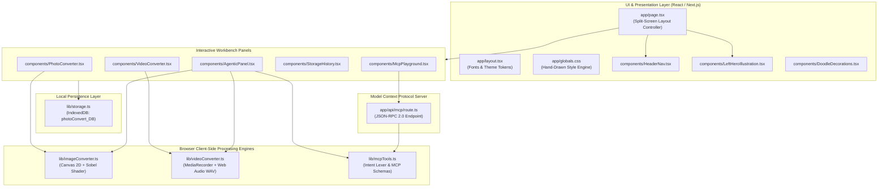

# PhotoNow Engine — Architecture & Development Logic

This document delivers a comprehensive technical breakdown of **PhotoNow Engine** (`PhotoNowEngine`). It details the system architecture, file-by-file responsibilities, data flow, underlying algorithms, and implementation logic.

---

## 1. High-Level Architecture Overview

PhotoNow Engine is built as an **offline-first, zero-cloud media transformation workstation**. All heavy compute tasks (rasterization, video transcoding, frame extraction, audio decoding, and binary packaging) are performed client-side inside the user's browser runtime.



---

## 2. Directory Tree Structure

```
photoConvert/
├── app/
│   ├── api/
│   │   └── mcp/
│   │       └── route.ts         # Model Context Protocol JSON-RPC 2.0 server endpoint
│   ├── favicon.ico              # App favicon
│   ├── globals.css              # Global hand-drawn monochrome styles & variables
│   ├── layout.tsx               # Root layout, Google Fonts injection, SEO metadata
│   ├── page.module.css          # Scoped helper utilities
│   └── page.tsx                 # Main workstation controller & tab router
├── components/
│   ├── AgenticPanel.tsx         # Natural-language prompt driven conversion bar
│   ├── DoodleDecorations.tsx    # Right vertical rotated tab strip & footer stamps
│   ├── HeaderNav.tsx            # Sticky navigation bar with bracketed tabs
│   ├── LeftHeroIllustration.tsx # 40% left column: SVG character & brand typography
│   ├── McpPlayground.tsx        # In-browser tester for JSON-RPC MCP calls
│   ├── PhotoConverter.tsx       # Image dropzone, settings sliders, preview grid
│   ├── StorageHistory.tsx       # IndexedDB history, storage metrics & ZIP export
│   └── VideoConverter.tsx       # Video player, timeline scrub, transcode & audio
├── lib/
│   ├── imageConverter.ts        # Canvas 2D image pipelines & Sobel ink shader
│   ├── loadBalancer.ts          # MCP cluster load balancer (round-robin, least-connections, weighted)
│   ├── mcpTools.ts              # MCP tool definitions & natural language parser
│   ├── rateLimiter.ts           # Sliding-window IP rate limiter & standard headers
│   ├── storage.ts               # IndexedDB wrapper (photoConvert_DB) & metrics
│   ├── types.ts                 # Shared TypeScript interfaces and types
│   └── videoConverter.ts        # Video transcode, poster grab & 16-bit WAV encoder
├── public/                      # Static SVG icons and assets
├── design.md                    # Visual design specification and constraints
├── next.config.ts               # Next.js configuration
├── package.json                 # Project dependencies and npm scripts
├── tsconfig.json                # TypeScript compiler configuration
├── README.md                    # Product overview & user guide
└── ARCHITECTURE.md              # System architecture and code logic (this document)
```

---

## 3. Detailed File-by-File Breakdown & Development Logic

---

### `lib/types.ts`
**Purpose**: Central data contracts, domain models, and type definitions across the entire workspace.

- **`ImageFormat`**: Union type `'webp' | 'png' | 'jpeg' | 'avif' | 'bmp'`.
- **`VideoFormat`**: Union type `'webm' | 'poster' | 'audio-wav' | 'gif'`.
- **`ImageConvertOptions`**:
  - `format`: Target output format.
  - `quality`: Float from `0.05` to `1.0`.
  - `maxWidth?`, `maxHeight?`: Boundary bounds for aspect-ratio locked downscaling.
  - `applySketchFilter?`: Boolean activating the Sobel ink algorithm.
  - `applyGrayscale?`, `applyInvert?`: Pixel-level image modifications.
  - `rotate?`: Numeric angle (`0`, `90`, `180`, `270`).
- **`VideoConvertOptions`**:
  - `action`: `'webm' | 'poster' | 'audio-wav'`.
  - `posterTime?`: Timestamp in seconds for frame capture.
  - `posterFormat?`: Output format for video snapshot (`'webp' | 'jpeg' | 'png'`).
  - `videoBitrate?`: Video encoding bitrate in bits per second (default: `2,500,000` bps).
  - `videoScale?`: Downscale factor (`1.0`, `0.75`, `0.5`).
  - `mute?`: Boolean indicating whether to strip audio tracks.
- **`StoredConversion`**:
  - Model representing a completed item stored in IndexedDB: `id`, `fileName`, `originalName`, `originalSize`, `convertedSize`, `savedBytes`, `percentSaved`, `mimeType`, `format`, `mediaType`, `timestamp`, `blob` (`Blob`), `previewUrl?`, `dimensions?`, `duration?`.
- **`AgentStep`**:
  - Step progress descriptor for the Agentic pipeline (`'plan' | 'tool_call' | 'processing' | 'done' | 'error'`).
- **`McpToolDefinition`**:
  - JSON Schema definition for MCP tools adhering to the Model Context Protocol.

---

### `lib/imageConverter.ts`
**Purpose**: Pure client-side Canvas 2D image manipulation engine and custom computer vision filters.

#### Key Functions & Implementation Logic:
1. **`getMimeType(format: ImageFormat): string`**:
   - Maps format identifiers to official MIME strings (`image/webp`, `image/png`, `image/jpeg`, `image/avif`, `image/bmp`).
2. **`loadImageFromFile(file: Blob): Promise<HTMLImageElement>`**:
   - Creates a temporary `URL.createObjectURL(file)`, assigns it to an `Image()` instance with `crossOrigin = 'anonymous'`, waits for `onload`, and immediately revokes the object URL via `URL.revokeObjectURL()` to prevent memory leaks.
3. **`applyInkSketchEffect(ctx, width, height)` (Custom Sobel Edge Detection + Crosshatch Dithering)**:
   - **Step 1: Grayscale Luminance Conversion**:
     Computes relative luminance for each pixel using the ITU-R BT.601 standard:
     $$Y = 0.299 \cdot R + 0.587 \cdot G + 0.114 \cdot B$$
     Stored into a flat `Float32Array(width * height)`.
   - **Step 2: 3x3 Sobel Convolution Kernels**:
     Calculates horizontal ($G_x$) and vertical ($G_y$) spatial gradient approximations:
     $$G_x = \begin{bmatrix} -1 & 0 & +1 \\ -2 & 0 & +2 \\ -1 & 0 & +1 \end{bmatrix}, \quad G_y = \begin{bmatrix} -1 & -2 & -1 \\ 0 & 0 & 0 \\ +1 & +2 & +1 \end{bmatrix}$$
     Calculates gradient magnitude: $\text{edge} = \sqrt{G_x^2 + G_y^2}$.
   - **Step 3: Sketch Compositing & Dithering**:
     Classifies pixels into solid ink black (`#0A0A0A` / RGB: 10, 10, 10) or off-white paper (`#F2F2F0` / RGB: 242, 242, 240):
     - Edge threshold: $\text{edge} > 45$ (strong contours).
     - Dark shadows: $Y < 75$.
     - Mid-tone crosshatching: $Y < 135 \land (x + y) \pmod 4 = 0$.
     - Light dithering: $Y < 185 \land (x \pmod 3 = 0 \land y \pmod 3 = 0)$.
     - Highlighting: All other pixels receive the off-white paper tone.
4. **`applyGrayscaleEffect(ctx, width, height)` & `applyInvertEffect(ctx, width, height)`**:
   - Direct pixel manipulation on `ImageData.data` for standard black-and-white conversion or color inversion ($255 - C$).
5. **`convertImage(source, options, originalFileName): Promise<StoredConversion>`**:
   - Determines target dimensions preserving aspect ratio against `options.maxWidth` and `options.maxHeight`.
   - Adjusts canvas dimensions for 90° or 270° orientation switches.
   - Executes matrix transformations via `ctx.translate()` and `ctx.rotate()` before painting.
   - If converting to JPEG, paints a solid `#FFFFFF` backdrop to prevent transparent alpha channels from rendering as black.
   - Applies active filters.
   - Encodes canvas output to binary blob via `canvas.toBlob(callback, mimeType, quality)`.
   - Calculates byte reduction statistics and generates a unique `StoredConversion` record.

---

### `lib/videoConverter.ts`
**Purpose**: In-browser video processing, sub-second poster frame extraction, Web Audio WAV decoding, and Canvas-to-WebM transcoding.

#### Key Functions & Implementation Logic:
1. **`loadVideoFromFile(file: Blob): Promise<HTMLVideoElement>`**:
   - Spawns an off-DOM `<video>` element with `preload = 'auto'`, `muted = true`, `playsInline = true`.
   - Resolves once `onloadedmetadata` fires so intrinsic width, height, and duration are established.
2. **`extractVideoPoster(file, originalFileName, timestamp, format, quality): Promise<StoredConversion>`**:
   - Clamps requested timestamp within $[0, \text{video.duration}]$.
   - Sets `video.currentTime = targetTime` and listens for the `seeked` event.
   - Draws active frame to a `<canvas>` matching video dimensions.
   - Converts canvas to WebP, JPEG, or PNG blob.
3. **`extractVideoAudioToWav(file, originalFileName): Promise<StoredConversion>`**:
   - Converts the video `Blob` into an `ArrayBuffer`.
   - Instantiates an `AudioContext` and invokes `audioCtx.decodeAudioData(arrayBuffer)`.
   - Automatically handles 1-channel (mono) and 2-channel (stereo) configurations.
   - Calls **`audioBufferToWavBlob()`** to write a compliant 44-byte RIFF header and 16-bit linear PCM little-endian samples:
     - Header layout:
       - `0x00-0x03`: `"RIFF"`
       - `0x04-0x07`: Chunk size ($36 + \text{data size}$)
       - `0x08-0x0B`: `"WAVE"`
       - `0x0C-0x0F`: `"fmt "` sub-chunk
       - `0x10-0x13`: Subchunk size (16 for PCM)
       - `0x14-0x15`: Audio format (1 = PCM)
       - `0x16-0x17`: Number of channels
       - `0x18-0x1B`: Sample rate (e.g. 44100 or 48000 Hz)
       - `0x1C-0x1F`: Byte rate ($\text{sampleRate} \times \text{channels} \times \frac{\text{bitsPerSample}}{8}$)
       - `0x20-0x21`: Block align ($\text{channels} \times \frac{\text{bitsPerSample}}{8}$)
       - `0x22-0x23`: Bits per sample (16)
       - `0x24-0x27`: `"data"` sub-chunk
       - `0x28-0x2B`: Audio data byte size
     - Samples are clamped between $[-1.0, 1.0]$ and quantized to signed 16-bit integers via `view.setInt16(offset, sample < 0 ? sample * 0x8000 : sample * 0x7FFF, true)`.
4. **`transcodeVideoToWebm(file, originalFileName, options, onProgress): Promise<StoredConversion>`**:
   - Downscales video resolution based on `options.videoScale` (`1.0`, `0.75`, `0.5`).
   - Hooks up `canvas.captureStream(30)` to grab 30 fps stream frames.
   - If audio is enabled (`!options.mute`), constructs an `AudioContext`, passes `video` into `createMediaElementSource()`, routes it through `createMediaStreamDestination()`, and merges audio tracks into the canvas stream.
   - Detects highest-capability WebM MIME codec available (`video/webm;codecs=vp9,opus`, `video/webm;codecs=vp8,opus`, etc.) via `MediaRecorder.isTypeSupported()`.
   - Starts `MediaRecorder` with requested bitrate (`options.videoBitrate`).
   - Launches a `requestAnimationFrame` render loop updating playback progress percentage until `video.onended` triggers.
   - Finalizes chunks into a single `video/webm` blob.

---

### `lib/storage.ts`
**Purpose**: IndexedDB abstraction layer managing client storage without external backend dependencies.

#### Key Functions & Implementation Logic:
- **Database Architecture**:
  - Name: `photoConvert_DB`
  - Version: `1`
  - Object Store: `conversions` (keyed by `id`)
  - Indexes: `timestamp` (for reverse-chronological sorting), `mediaType` (for filtering).
- **`saveConversion(item: StoredConversion): Promise<string>`**:
  - Opens a `readwrite` transaction and inserts/updates record via `store.put(item)`.
- **`getAllConversions(): Promise<StoredConversion[]>`**:
  - Opens a `readonly` transaction on the `timestamp` index.
  - Utilizes `index.openCursor(null, 'prev')` to retrieve records sorted newest-to-oldest.
- **`deleteConversion(id: string): Promise<void>`**:
  - Deletes specific record by ID.
- **`clearAllConversions(): Promise<void>`**:
  - Wipes all entries from the `conversions` store.
- **`getStorageStats()`**:
  - Computes file count and total bytes stored.
  - Calls `navigator.storage.estimate()` (if supported) to retrieve browser storage quota metrics.
- **`formatBytes(bytes: number): string`**:
  - Helper formatting raw byte counts into human-readable strings (`B`, `KB`, `MB`, `GB`).

---

### `lib/mcpTools.ts`
**Purpose**: Exposes Model Context Protocol (MCP) tool metadata, agentic prompt parsing, and sample configuration.

#### Components:
1. **`MCP_TOOLS`**:
   - Formally defined JSON Schema descriptions for five core MCP tools:
     - `convert_image`: Target format, quality, max bounds, sketch shader, rotation.
     - `convert_video`: Transcode to WebM, resolution scale, bitrate, audio mute.
     - `extract_poster_frame`: Seek second, format, quality.
     - `extract_audio`: WAV extraction.
     - `list_storage_conversions`: Query stored assets by media type.
2. **`parseAgentPrompt(prompt: string)`**:
   - Rule-based natural language intent parser.
   - Analyzes user input strings for keywords:
     - Identifies target domain (`image` vs `video`).
     - Extracts quality levels (e.g. `80%` $\to$ `0.8`).
     - Extracts dimension targets (e.g. `1200px`, `1080p`, `720p`).
     - Identifies shader toggles (`sketch`, `ink`, `doodle`, `monochrome`, `grayscale`, `invert`).
     - Extracts video seek timestamps (e.g. `1.5s`).
   - Produces a deterministic action summary and ordered step sequence (`steps[]`).
3. **`SAMPLE_MCP_CLIENT_CONFIG`**:
   - Pre-formatted JSON snippet ready for inclusion into agent configuration files (Claude, Antigravity, Cursor).

---

### `lib/rateLimiter.ts`
**Purpose**: Sliding-window IP rate limiter safeguarding the MCP server from DDoS, crawler hammering, and serverless quota exhaustion.

#### Key Functions & Implementation Logic:
- **`checkRateLimit(req: NextRequest, options?)`**:
  - Extracts client IP across `x-forwarded-for`, `x-real-ip`, and `cf-connecting-ip`.
  - Maintains a sliding-window timestamp array per IP in-memory (`Map<string, RateLimitRecord>`).
  - Automatically filters expired timestamps ($now - ts < windowMs$).
  - Evaluates request quota against policy limit (Default: 60 requests / minute).
  - Emits standard rate-limiting headers:
    - `X-RateLimit-Limit`: Maximum requests per window (60).
    - `X-RateLimit-Remaining`: Remaining request allowance in active window.
    - `X-RateLimit-Reset`: Epoch second when quota refreshes.
    - `Retry-After`: Seconds to wait before retry (emitted on HTTP 429).
- **`pruneStaleRecords(windowMs)`**:
  - Self-cleaning garbage collector executing every 60 seconds to evict inactive IP buckets, preventing memory leaks in persistent processes.

---

### `lib/loadBalancer.ts`
**Purpose**: Multi-node MCP dispatch orchestrator, health monitoring, and circuit breaker.

#### Key Functions & Implementation Logic:
- **`acquireNode(strategy)`**:
  - Dynamically selects execution worker nodes according to industrial load balancing algorithms:
    - **`least-connections`** (Default): Routes requests to the worker currently executing the fewest active concurrent in-flight tasks.
    - **`round-robin`**: Fair sequential rotation across all online nodes.
    - **`weighted`**: Capacity-rated distribution proportional to node weights.
  - Automatically increments active connection counters.
- **`releaseNode(nodeId, success, durationMs)`**:
  - Releases in-flight concurrency lock.
  - Calculates Exponential Moving Average (EMA) latency for node health metrics.
  - **Circuit Breaker**: Automatically flags nodes as `degraded` after 3 consecutive failures, and trips the circuit to `offline` after 5 failures to prevent routing blackholes.
- **`getClusterSnapshot()`**:
  - Returns real-time health telemetry across the cluster for developer dashboards.

---

### `app/api/mcp/route.ts`
**Purpose**: Full Next.js Route Handler implementing the Model Context Protocol over JSON-RPC 2.0.

#### Endpoints:
- **`GET /api/mcp`**:
  - Returns server metadata, version `1.0.0`, protocol `mcp-jsonrpc-2.0`, and list of available tools.
- **`POST /api/mcp`**:
  - Validates JSON-RPC 2.0 structure (`jsonrpc === "2.0"`).
  - Handles MCP protocol handshake:
    - `initialize`: Returns protocol version `2024-11-05` and server capabilities.
    - `notifications/initialized`: Acknowledges client readiness.
    - `tools/list`: Returns full tool inventory from `MCP_TOOLS`.
    - `tools/call`: Dispatches specified tool name and validates input parameters, returning structured execution responses.

---

### `components/PhotoConverter.tsx`
**Purpose**: Primary user interface for photo conversion and batch processing.

- **State Management**:
  - `selectedFiles`: Array of currently selected `File` objects.
  - `previewUrls`: Mapping of file names to object URLs.
  - `format`, `quality`, `maxDimension`, `applySketch`, `applyGrayscale`, `applyInvert`, `rotate`: Conversion controls.
  - `isConverting`: Busy state flag.
  - `latestResults`: Collection of `StoredConversion` items from the latest run.
- **Workflow**:
  - Drag-and-drop listener updates UI hover states.
  - Batch loop iterates sequentially over all chosen files, running `convertImage()` and saving each result to IndexedDB via `saveConversion()`.
  - Notifies parent controller via `onConversionSuccess()`.
  - Displays side-by-side results with saved percentage badges and individual download buttons.

---

### `components/VideoConverter.tsx`
**Purpose**: Video player interface, timeline scrubbing, snapshot extractor, WAV audio decoder, and WebM transcoder.

- **State Management**:
  - `videoFile`, `videoUrl`: Mounted video asset.
  - `currentTime`, `duration`: Tracked from the video element.
  - `selectedAction`: Mode switcher (`'poster'` | `'audio'` | `'webm'`).
  - `progress`: Real-time transcode percentage indicator (0% to 100%).
- **Interactive Features**:
  - Dual time-sync: Scrubbing either the video progress bar or the custom range input synchronizes `videoRef.current.currentTime`.
  - Real-time transcoding progress animation during WebM generation.
  - Automatic error handling for video containers without valid audio tracks.

---

### `components/AgenticPanel.tsx`
**Purpose**: Autonomous agentic command interface that parses human text and executes corresponding conversions.

- **Interactive Features**:
  - Natural language input with quick-select preset pills.
  - Live execution log simulating autonomous thought and tool dispatch (`[INTENT ANALYSIS]`, `[EXECUTION PLAN READY]`, `[DISPATCHING MCP TOOL]`, `[LOCAL STORAGE COMMIT]`).
  - Automatically branches between image pipelines and video pipelines based on media MIME type and parsed prompt intents.

---

### `components/StorageHistory.tsx`
**Purpose**: Local storage management dashboard, metrics viewer, and batch ZIP packager.

- **Interactive Features**:
  - Queries `getAllConversions()` on mount and after updates.
  - Displays total count, total byte footprint, and bandwidth saved metrics.
  - Filter tabs: `ALL`, `IMAGE`, `VIDEO`, `AUDIO`.
  - **Batch ZIP Export**: Uses `JSZip` to bundle all stored Blobs into `photonow_conversions/` and prompts download as `photonow_bundle_[timestamp].zip`.
  - One-click deletion per file or global wipe.

---

### `components/McpPlayground.tsx`
**Purpose**: In-app developer console for testing the `/api/mcp` JSON-RPC endpoint.

- Allows developers to trigger `initialize`, `tools/list`, or `tools/call` against `/api/mcp`.
- Features a one-click button to copy the agent configuration schema into clipboard.
- Displays raw formatted JSON responses for rapid verification.

---

### `components/LeftHeroIllustration.tsx`
**Purpose**: Visual branding anchor occupying 40% of the screen width.

- Renders huge all-caps typography jumping 8–10× above body font size (`clamp(3.8rem, 7vw, 6.4rem)`).
- Embeds hand-drawn vector artwork with SVG ink lines, comic annotations (`"HEY."` with drawn arrows), and film/camera doodles.
- Establishes the physical sketchbook motif.

---

### `components/HeaderNav.tsx`
**Purpose**: Top sticky navigation header.

- Renders brand badge (`[NOW] PHOTONOW.ENGINE`) and runtime indicator (`• 100% LOCAL BROWSER RUNTIME •`).
- Implements bracketed tab selectors: `[PHOTO CONVERT]`, `[VIDEO CONVERT]`, `[AGENTIC AI]`, `[STORAGE: N]`, and `[MCP SERVER]`.
- Displays real-time badge count reflecting stored items in IndexedDB.

---

### `components/DoodleDecorations.tsx`
**Purpose**: Floating decorative elements adhering to the hand-drawn design specification.

- **`RightVerticalTabStrip`**: Fixed rotated black sidebar tab on the right edge of the viewport (`[WORKBENCH • LOCAL ENGINE]`).
- **`FooterStamps`**: Bottom hand-drawn status stamps (`STRICTLY MONOCHROME`, `ZERO CLOUD`, `INDEXEDDB ENGINE`).

---

### `app/page.tsx`
**Purpose**: Root page controller and state coordinator.

- Manages `activeTab` state (`'photo' | 'video' | 'storage' | 'agent' | 'mcp'`).
- Manages `storageCount` state and provides `refreshStorageStats` callback.
- Establishes the responsive two-column grid layout (40% hero illustration on the left, 60% dynamic workspace on the right).

---

### `app/layout.tsx`
**Purpose**: Next.js root layout.

- Injects Google Fonts:
  - `Space Mono`: Technical monospace numbers and button labels.
  - `Permanent Marker`: Thick, wobbly display headlines.
- Configures viewport settings and SEO metadata tags.

---

### `app/globals.css`
**Purpose**: Design system foundation and visual token declarations.

- Defines CSS custom properties:
  - `--bg-paper: #F2F2F0`
  - `--ink: #0A0A0A`
  - `--ink-inverted: #F2F2F0`
  - `--ink-gray: #444444`
  - `--ink-subtle: #888888`
  - `--paper-tint: #E8E8E5`
- Implements hand-drawn irregular border geometry:
  `border-radius: 255px 15px 225px 15px / 15px 225px 15px 255px;`
- Applies subtle paper grain noise overlay using CSS radial-gradient dots.
- Configures cross-browser vendor prefixes (including `-webkit-user-select: none;` for Safari/iOS compatibility).
- Customizes dark-ink scrollbars and sketch-style range sliders.

---

## 4. Subsystem Data Flows

### A. Photo Conversion Flow

```
[User Selects File(s)]
         │
         ▼
[loadImageFromFile(Blob)] ──▶ Creates temporary Object URL ──▶ HTMLImageElement
         │
         ▼
[Calculate Target Dimensions] (Preserving aspect ratio against max bounds)
         │
         ▼
[Setup Canvas & Coordinate Transforms] (Handles 0°, 90°, 180°, 270° orientation)
         │
         ▼
[Rasterize Image] (ctx.drawImage)
         │
         ▼
[Apply Shaders / Filters]
   ├── Sobel Edge Convolution (applyInkSketchEffect)
   ├── Grayscale Luminance (applyGrayscaleEffect)
   └── Color Inversion (applyInvertEffect)
         │
         ▼
[canvas.toBlob(format, quality)] ──▶ Generates converted binary Blob
         │
         ▼
[saveConversion(item)] ──▶ Commits record to IndexedDB ("photoConvert_DB")
         │
         ▼
[Update UI & Previews] ──▶ Display byte savings & ready download
```

---

### B. Video & Audio Extraction Flow

```
[User Selects Video (.mp4 / .webm / .mov)]
         │
         ▼
[loadVideoFromFile(Blob)] ──▶ Mounts to HTMLVideoElement ──▶ Reads duration & dimensions
         │
         ├─── Mode: "poster" ──▶ Seek currentTime ──▶ Canvas Draw ──▶ canvas.toBlob()
         │
         ├─── Mode: "audio"  ──▶ Blob.arrayBuffer() ──▶ AudioContext.decodeAudioData()
         │                                                      │
         │                                                      ▼
         │                                            [audioBufferToWavBlob()]
         │                                            (Writes 44-byte RIFF Header
         │                                             + 16-bit PCM samples)
         │
         └─── Mode: "webm"   ──▶ canvas.captureStream(30) + AudioTrack Destination
                                                        │
                                                        ▼
                                              [MediaRecorder (VP9/VP8)]
                                                        │
                                                        ▼
                                              [Assemble Chunks into WebM Blob]
         │
         ▼
[Commit to IndexedDB] ──▶ Refresh Storage Stats ──▶ Render Output Preview
```

---

### C. Model Context Protocol (MCP) Flow

```
[External AI Agent / Playground]
         │
         ▼
[POST /api/mcp] (JSON-RPC 2.0 Payload)
         │
         ├─── method: "initialize" ───────────────▶ Returns protocolVersion & capabilities
         ├─── method: "tools/list" ───────────────▶ Returns MCP_TOOLS Schema definitions
         └─── method: "tools/call" ───────────────▶ Matches tool name (convert_image, etc.)
                                                        │
                                                        ▼
                                            Validates Schema & Parameters
                                                        │
                                                        ▼
                                            Dispatches Execution Envelope
                                                        │
                                                        ▼
                                            Returns JSON-RPC 2.0 Result
```

---

## 5. Memory Management & Performance Guardrails

Because PhotoNow processes large media files directly in browser memory, the codebase strictly observes memory hygiene:
1. **Object URL Lifecycle**: Temporary URLs generated for intermediate operations (`loadImageFromFile`, `loadVideoFromFile`) are immediately revoked via `URL.revokeObjectURL()` once the DOM element finishes loading.
2. **AudioContext Teardown**: Whenever an audio track is extracted, `audioCtx.close()` is awaited to release hardware audio pipelines immediately.
3. **Chunk Buffering**: MediaRecorder captures video stream buffers in segmented increments (`mediaRecorder.start(100)`), preventing buffer overrun before assembly.
4. **IndexedDB Blob Persistence**: Media files are stored as structured `Blob` instances within IndexedDB rather than Base64 strings, eliminating the ~33% Base64 memory overhead and preventing JavaScript heap thrashing.

---

## 6. Summary

PhotoNow Engine pairs an artisanal, hand-drawn physical design aesthetic with a zero-cloud, hardware-accelerated media engine and an agent-ready MCP server. By decoupling media manipulation from remote cloud servers, it delivers instant processing speeds, total privacy, and offline autonomy.
