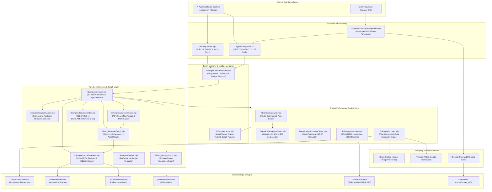

# PhotoNow Engine — Architecture & Development Logic Specification

> **The Definitive System Architecture, File-by-File Technical Breakdown, and Development Logic for the PhotoNow Website Performance Intelligence & Asset Optimization Platform.**

---

## 1. High-Level Architectural Vision

PhotoNow Engine (`PhotoNowEngine`) is engineered as an **offline-first, zero-cloud media performance intelligence workstation and autonomous Model Context Protocol (MCP) tool server**.

All compute tasks (rasterization, video transcoding, frame extraction, audio decoding, static AST parsing, graph dependency mapping, and patch formulation) execute **100% locally** using native Node.js (Sharp, FFmpeg) and the browser runtime (HTML5 Canvas 2D, Web Audio API, IndexedDB).



---

## 2. Directory Tree Structure

```
photoNow/
├── bin/
│   └── mcp-server.mjs                 # Stdio MCP server (29 tools, static binaries, sharp)
├── app/
│   ├── api/
│   │   └── mcp/route.ts               # HTTP JSON-RPC 2.0 MCP endpoint (29 tools)
│   ├── globals.css                    # Hand-drawn ink design tokens & animations
│   ├── layout.tsx                     # App layout, Google Fonts, JSON-LD Schema & AEO
│   ├── page.tsx                       # Workstation controller & split-screen grid
│   ├── icon.svg                       # Favicon SVG
│   ├── apple-icon.png                 # Apple Touch Icon
│   ├── robots.ts                      # SEO robots configuration
│   └── sitemap.ts                     # Automated sitemap generator
├── components/
│   ├── McpDeveloperHub.tsx            # Developer MCP Hub, Prompt Generator & Testing Console
│   ├── PhotoConverter.tsx             # Image dropzone, settings sliders, preview grid
│   ├── VideoConverter.tsx             # Video player, timeline scrub, transcode & audio
│   ├── StorageHistory.tsx             # IndexedDB history manager & ZIP bundle exporter
│   ├── McpPlayground.tsx              # In-browser JSON-RPC test console
│   ├── HeaderNav.tsx                  # Sticky bracketed header navigation
│   ├── LeftHeroIllustration.tsx       # Left-column hand-drawn character illustration
│   ├── DoodleDecorations.tsx          # Right-edge tab strip & footer stamps
│   └── AgenticPanel.tsx               # Natural-language prompt simulation bar
├── lib/
│   ├── engine/                        # Core Performance Engine (Shared by Stdio & HTTP MCP)
│   │   ├── types.ts                   # TypeScript interfaces & domain models
│   │   ├── tokenEconomy.mjs           # Progressive disclosure & token budgeting (<200 tokens)
│   │   ├── perceptualHash.mjs         # 64-bit dHash gradient difference & SHA-256
│   │   ├── cache.mjs                  # Local memory cache for plans & test snapshots
│   │   ├── analyzer.mjs               # 5-axis scorer & media bottleneck classifier
│   │   ├── performanceTester.mjs      # Web auditor, LCP candidate & 4G mobile latency
│   │   ├── booster.mjs                # Planner, safe Sharp transcoder & validator
│   │   ├── reporting.mjs              # Zero-dependency offline HTML/MD reporter
│   │   ├── projectScanner.mjs         # Framework, route tree & media root scanner
│   │   ├── sourceAnalyzer.mjs         # AST & regex <Image> tag and priority parser
│   │   ├── assetGraph.mjs             # Asset Dependency Graph & dead asset triage
│   │   ├── patchGenerator.mjs         # Unified diffs, backups & rollback engine
│   │   ├── browserVerifier.mjs        # OBSERVED vs SIMULATED runtime performance
│   │   ├── budget.mjs                 # Performance budget rule validator
│   │   ├── regression.mjs             # Git commit awareness & branch baselines
│   │   └── mission.mjs                # 10-step autonomous mission orchestrator
│   ├── imageConverter.ts              # Browser Canvas 2D client processing
│   ├── videoConverter.ts              # Browser MediaRecorder & Web Audio WAV decoder
│   ├── storage.ts                     # Browser IndexedDB raw database wrapper
│   ├── mcpTools.ts                    # MCP tool schema catalog & prompt lexer
│   ├── rateLimiter.ts                 # Sliding-window IP rate limiter
│   ├── loadBalancer.ts                # Request telemetry & cluster metrics
│   └── utils.ts                       # Shared byte formatting & path utilities
├── tests/
│   ├── unit/
│   │   └── test-agentic-intelligence.mjs # 7-suite unit tests for agentic pillars
│   ├── fixtures/                      # Realistic Next.js & Vite test sandboxes
│   ├── sandbox_catalog/               # Live fixture for all 29 tools & external agents
│   ├── test-autonomous-mission.mjs    # End-to-end mission, dry-run & rollback tests
│   ├── test-mcp-catalog.mjs           # 29-tool verification over stdio JSON-RPC
│   ├── test-mcp-http.mjs              # HTTP JSON-RPC 2.0 endpoint verification
│   ├── test-external-sandbox.mjs      # 15-stage sandboxed external project verification
│   ├── test-security-edge-cases.mjs   # 15 adversarial security penetration tests
│   ├── sync-mcp-schemas.mjs           # Schema synchronization between Stdio & HTTP
│   └── benchmark.mjs                  # Cold/warm scan benchmarks & memory profiling
└── package.json                       # Dependencies, npm scripts & binary link
```

---

## 3. Core Engine Architecture (`lib/engine/`)

### 3.1. Token Economy & Progressive Disclosure (`tokenEconomy.mjs`)
AI coding assistants operate within finite context windows. Raw directory dumps and base64 strings rapidly cause context truncation.

PhotoNow implements **Progressive Disclosure**:
- `compact` (Default): Returns a deterministic envelope `< 200 tokens`:
  ```json
  {
    "ok": true,
    "summary": { "score": 82, "totalAssets": 15, "potentialSavings": "240 KB" },
    "recommendations": ["Convert photographic PNGs to WebP/AVIF"],
    "nextAction": "generate_optimization_plan"
  }
  ```
- `standard`: Adds categorized issue lists and potential byte savings.
- `detailed`: Full per-file records, dimensions, hashes, and timings.
- `tokenBudget`: Enforces strict numerical limits, prioritizing high-severity issues and emitting `truncated: true`.

### 3.2. Perceptual Difference Hashing (`perceptualHash.mjs`)
Identifies identical and near-identical images regardless of filename differences:
1. Downsamples image to 9×8 grayscale bitmap using Sharp.
2. Compares each pixel with its horizontal neighbor to generate a 64-bit BigInt hash (`dHash`).
3. Evaluates Hamming distance between all asset pairs. Any pair with similarity > 93% is grouped together with potential consolidation savings.

### 3.3. 5-Axis Media Scoring System (`analyzer.mjs`)
Calculates an explainable performance score from 0 to 100 points:
1. **Format Efficiency (25 pts)**: Percentage of modern formats (WebP, AVIF, SVG) vs legacy formats (PNG, JPEG, BMP).
2. **Image Sizing (25 pts)**: Penalizes images exceeding desktop viewports (>1920px).
3. **Compression Density (20 pts)**: Penalizes low-entropy, uncompressed photographic images.
4. **Responsive Readiness (15 pts)**: Evaluates whether large assets have mobile/tablet responsive breakpoints.
5. **SVG Efficiency (15 pts)**: Detects raster images embedded inside SVGs or uncompressed vector bloat.

### 3.4. Asset Dependency Graph (`assetGraph.mjs`)
Maintains an internal dependency model:
```
Route ➔ Component ➔ SourceFile ➔ Asset ➔ Variant
```
- **Usage Tracking**: Counts exact references per asset and identifies the declaring components.
- **Dead Asset Triage**:
  - `SAFE`: Zero references in any code or config. Safe to prune.
  - `LIKELY`: Zero direct references, but matches dynamic naming patterns (`icon-${id}.png`).
  - `UNCERTAIN`: Referenced via ambiguous string interpolation.
- **Shared Asset Risk**: Warns when an asset is used across multiple routes to prevent downscaling regressions.

### 3.5. Source-Code Patching & Rollback Engine (`patchGenerator.mjs`)
Empowers agents to update developer code safely:
- **Dry-Run by Default**: Never modifies files without explicit developer confirmation (`dryRun: false`).
- **Unified Diffs**: Generates standard `diff -u` representations for user review.
- **Automated Backups**: Original source files are copied into `.photonow/backups/[operationId]/` before editing.
- **Manifest-Backed Rollback**: Emits a cryptographic manifest to `.photonow/manifests/manifest_[operationId].json`. Calling `rollbackOperation(operationId)` restores all source files and media in 1 second.

### 3.6. Performance Budgets & Git Regression Guard (`budget.mjs` & `regression.mjs`)
- Enforces budget limits: Total media (<500 KB), single hero (<150 KB), LCP (<2.5s).
- Inspects Git commit hash (`git rev-parse HEAD`) and branch name.
- Compares audits against `.photonow/baselines/[branch].json` to prevent performance regressions in pull requests.

### 3.7. Autonomous Mission Orchestrator (`mission.mjs`)
Runs the complete 10-step lifecycle in a single call:
`DISCOVER ➔ UNDERSTAND ➔ ANALYZE ➔ MEASURE ➔ DIAGNOSE ➔ PLAN ➔ PATCH ➔ OPTIMIZE ➔ VERIFY ➔ REPORT`.

---

## 4. Complete 29-Tool MCP Catalog

PhotoNow exposes 29 tools over stdio and HTTP JSON-RPC 2.0:

| Category | Tool Name | Description |
| :--- | :--- | :--- |
| **Multimedia Foundation** | `convert_image` | Image conversion to WebP, PNG, JPEG, AVIF with quality, rotation, ink filters |
| *(Original 8 Tools)* | `convert_batch` | Batch folder image conversion with recursion filters |
| | `convert_video` | Video transcode / compress with FFmpeg |
| | `extract_audio` | Video to MP3/WAV audio extraction |
| | `convert_audio` | Audio format transcoding |
| | `extract_poster_frame` | Seek and capture clean video poster frame |
| | `get_media_info` | Unified metadata inspector (image, video, audio) |
| | `optimize_for_agent` | Downscale UI screenshots to compact WebP for vision LLMs |
| **Performance Intelligence**| `analyze_media` | Inspect single asset for performance bottlenecks |
| *(12 Media Tools)* | `analyze_web_assets` | Project-wide media scan, PhotoNow score, top issues |
| | `find_oversized_assets` | Filter assets exceeding dimensional/byte thresholds |
| | `find_inefficient_formats` | Identify photographic PNGs, legacy JPEGs, GIFs |
| | `find_duplicate_assets` | Perceptual dHash & SHA-256 duplicate clustering |
| | `find_responsive_opportunities`| Pinpoint high-res images lacking responsive srcset |
| | `test_web_performance` | Asset-centric web auditor, LCP candidate & score |
| | `get_web_performance_summary` | Retrieve compact summary of previous audit |
| | `compare_web_performance` | Compare before vs after audit snapshots |
| | `generate_optimization_plan` | Formulate actionable plan with `planId` and estimates |
| | `optimize_web_assets` | Safely execute plan with Sharp, validation, & idempotency |
| | `verify_optimization` | Verify measured reductions and generate local reports |
| **Agentic System Tools** | `inspect_project` | Scan framework, routes, component tree, media directories |
| *(9 Master Tools)* | `get_asset_usage` | Trace asset usage chain (`Route ➔ Component ➔ SourceFile`) and LCP status |
| | `find_unused_assets` | Detect dead assets categorized by safety tier (`SAFE`, `LIKELY`, `UNCERTAIN`) |
| | `check_performance_budget` | Evaluate against page bytes, image bytes, hero bytes, and LCP budgets |
| | `verify_runtime_performance` | Runtime performance metrics (`OBSERVED` via browser or `SIMULATED` fallback) |
| | `generate_source_patch` | Generate unified diffs updating image tags and file paths in source code |
| | `apply_source_patch` | Safely apply source patch with automatic backups and manifest generation |
| | `rollback_operation` | Atomically revert source files and assets to pre-patch state |
| | `optimize_project` | Autonomous end-to-end mission executing full 10-step lifecycle |

---

## 5. Security Architecture & Defensive Guards

1. **Strict File Extension Whitelisting**: Accepts only approved media extensions (`.png`, `.jpg`, `.jpeg`, `.webp`, `.avif`, `.gif`, `.svg`, `.mp4`, `.webm`, `.mov`, `.wav`, `.mp3`). Requests targeting `.exe`, `.bat`, `.env`, `.json`, `.js`, or `.sh` are rejected immediately.
2. **Sensitive Folder Exclusions**: Batch and recursive operations automatically ignore `.git/`, `.env`, `node_modules/`, and `.next/`.
3. **Path Traversal Guards**: Strips path traversal sequences (`../`, `..\`) and normalizes paths against system roots to prevent directory escapes.
4. **Decodability Checks**: Every transformed media file is decoded back through Sharp before marking the operation successful. Corrupted outputs are discarded immediately.
5. **Sliding-Window IP Rate Limiting**: Protects the `/api/mcp` endpoint with configurable per-IP limits (default 60 req/min) while Stdio execution operates at native OS speeds without artificial network throttles.

---

## 6. Cross-References

- **Step-by-Step Implementation & Hands-On User Guide**: [`BUILD_FROM_SCRATCH_GUIDE.md`](file:///c:/Users/sibas/OneDrive/Desktop/Projects/photoNow/BUILD_FROM_SCRATCH_GUIDE.md)
- **Codebase Cleanup & Technical Debt Analysis**: [`CODEBASE_CLEANUP_AND_TECHNICAL_DEBT_ANALYSIS.md`](file:///c:/Users/sibas/OneDrive/Desktop/Projects/photoNow/CODEBASE_CLEANUP_AND_TECHNICAL_DEBT_ANALYSIS.md)
- **Primary Product Overview**: [`README.md`](file:///c:/Users/sibas/OneDrive/Desktop/Projects/photoNow/README.md)
