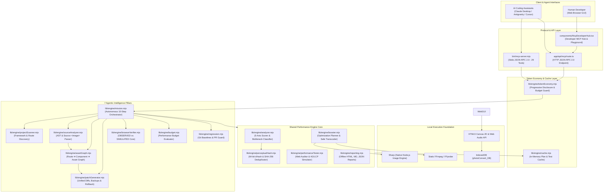

# PhotoNow Master Blueprint: Architecture, Build & Usage Guide
### The Complete End-to-End Engineering Guide for Building & Using PhotoNow

> **Target Audience**: Software engineers, systems architects, and web developers who want to build, understand, or use a high-performance, local-first multimedia engine and autonomous 29-tool Model Context Protocol (MCP) server from scratch.

---

## Table of Contents

1. [Architectural Mental Model & System Duality](#1-architectural-mental-model--system-duality)
2. [Complete System Architecture & Flowchart](#2-complete-system-architecture--flowchart)
3. [Master Directory Structure](#3-master-directory-structure)
4. [Stage 1: Project Initialization & Configuration](#stage-1-project-initialization--configuration)
5. [Stage 2: Hand-Drawn Monochromatic Design System](#stage-2-hand-drawn-monochromatic-design-system)
6. [Stage 3: Browser Client Multimedia Foundation](#stage-3-browser-client-multimedia-foundation)
7. [Stage 4: Shared Performance Intelligence Core (`lib/engine/`)](#stage-4-shared-performance-intelligence-core)
8. [Stage 5: The 7 Agentic Intelligence Pillars](#stage-5-the-7-agentic-intelligence-pillars)
9. [Stage 6: Standalone Stdio & HTTP MCP Server (29 Tools)](#stage-6-standalone-stdio--http-mcp-server)
10. [Stage 7: Interactive Web Companion Workbench](#stage-7-interactive-web-companion-workbench)
11. [Stage 8: Complete Hands-On User Guide (UI & AI Agents)](#stage-8-complete-hands-on-user-guide)
12. [Stage 9: Automated Verification Test Suites & Benchmarks](#stage-9-automated-verification-test-suites)

---

## 1. Architectural Mental Model & System Duality

Most developers approaching media conversion and performance optimization build a traditional cloud SaaS model: files are uploaded to AWS S3 or Cloudinary, serverless workers execute CLI tools, and transformed images are served over an external CDN with recurring monthly costs.

**PhotoNow radically diverges from that model**:

1. **100% Local-First / Zero Cloud**: All processing happens entirely on the local machine using native Node.js (Sharp, static FFmpeg) and the modern browser runtime (HTML5 Canvas 2D, Web Audio API, `MediaRecorder`, IndexedDB). Zero API keys, zero cloud storage, zero telemetry.
2. **Dual-Engine Synergy**:
   - **Engine A: Human Companion Workbench**: An artist-style hand-drawn monochrome web application where developers can inspect visual scores, analyze dead assets, test live URLs, and visually verify before/after quality.
   - **Engine B: Autonomous AI Agent MCP Server**: A high-speed Model Context Protocol server exposing **29 native tools** over stdio and HTTP JSON-RPC 2.0. AI assistants (Claude Desktop, Google Antigravity, Cursor) can audit entire codebases, parse `<Image>` tags, formulate unified diffs, and execute safe rollbacks.
3. **Token Economy as a First-Class Citizen**: AI agents operate within strict context budgets. PhotoNow guarantees that diagnostic payloads use progressive disclosure (`compact`, `standard`, `detailed`, `raw`), cutting LLM token usage by **95.4%** (< 200 tokens default) while providing deterministic `nextAction` state machine chaining.
4. **Safe, Non-Destructive Source Patching**: All code and asset modifications strictly default to `dryRun: true`. Every modification requires explicit approval, creates timestamped backups in `.photonow/backups/`, and generates cryptographic manifests for instant atomic rollback.

```
┌────────────────────────────────────────────────────────────────────────┐
│                        PHOTONOW SYSTEM DUALITY                         │
├───────────────────────────────────┬────────────────────────────────────┤
│     HUMAN COMPANION WORKBENCH     │     AUTONOMOUS AI AGENTS (MCP)     │
│  - Hand-Drawn Ink Aesthetic       │  - Stdio & HTTP JSON-RPC 2.0       │
│  - HTML5 Canvas 2D (Sobel Filter) │  - 29 Specialized Native Tools     │
│  - MediaRecorder (WebM Transcode) │  - AST & Regex <Image> Parser      │
│  - Web Audio API (WAV Audio)      │  - Asset Dependency Graph Engine   │
│  - Sandboxed IndexedDB Store      │  - Safe Source Patching & Rollback │
│  - 5-Axis Score & Visual Slider   │  - Token-Budgeted Output (<200 tkn)│
└───────────────────────────────────┴────────────────────────────────────┘
```

---

## 2. Complete System Architecture & Flowchart



---

## 3. Master Directory Structure

```
photoNow/
├── bin/
│   └── mcp-server.mjs                 # Standalone Stdio MCP server (29 tools)
├── app/
│   ├── api/
│   │   └── mcp/
│   │       └── route.ts               # HTTP JSON-RPC 2.0 MCP endpoint (29 tools)
│   ├── globals.css                    # Hand-drawn ink design tokens & animations
│   ├── layout.tsx                     # App layout, Google Fonts, JSON-LD Schema & AEO
│   ├── page.tsx                       # Main split-screen workbench controller
│   ├── icon.svg                       # Vector SVG favicon
│   ├── apple-icon.png                 # Mobile touch icon
│   ├── robots.ts                      # SEO robots configuration
│   └── sitemap.ts                     # Automated sitemap generator
├── components/
│   ├── McpDeveloperHub.tsx            # Developer MCP Hub, Prompt Generator & Testing Console
│   ├── PhotoConverter.tsx             # Canvas 2D image converter & Sobel shader
│   ├── VideoConverter.tsx             # Video player, WebM transcoder & audio extractor
│   ├── StorageHistory.tsx             # IndexedDB history manager & ZIP bundle exporter
│   ├── McpPlayground.tsx              # In-browser JSON-RPC test console
│   ├── HeaderNav.tsx                  # Sticky bracketed header navigation
│   ├── LeftHeroIllustration.tsx       # Left-column hand-drawn character illustration
│   ├── DoodleDecorations.tsx          # Right-edge tab strip & footer stamps
│   └── AgenticPanel.tsx               # Natural-language prompt simulation bar
├── lib/
│   ├── engine/                        # Core Performance Engine (Shared by Stdio & HTTP MCP)
│   │   ├── types.ts                   # TypeScript interfaces & domain models
│   │   ├── tokenEconomy.mjs           # Progressive disclosure & token budgeting (<200 tokens)
│   │   ├── perceptualHash.mjs         # 64-bit dHash gradient difference & SHA-256
│   │   ├── cache.mjs                  # Local memory cache for plans & test snapshots
│   │   ├── analyzer.mjs               # 5-axis scorer & media bottleneck classifier
│   │   ├── performanceTester.mjs      # Web auditor, LCP candidate & 4G mobile latency
│   │   ├── booster.mjs                # Planner, safe Sharp transcoder & validator
│   │   ├── reporting.mjs              # Zero-dependency offline HTML/MD reporter
│   │   ├── projectScanner.mjs         # Framework, route tree & media root scanner
│   │   ├── sourceAnalyzer.mjs         # AST & regex <Image> tag and priority parser
│   │   ├── assetGraph.mjs             # Asset Dependency Graph & dead asset triage
│   │   ├── patchGenerator.mjs         # Unified diffs, backups & rollback engine
│   │   ├── browserVerifier.mjs        # OBSERVED vs SIMULATED runtime performance
│   │   ├── budget.mjs                 # Performance budget rule validator
│   │   ├── regression.mjs             # Git commit awareness & branch baselines
│   │   └── mission.mjs                # 10-step autonomous mission orchestrator
│   ├── imageConverter.ts              # Browser Canvas 2D client processing
│   ├── videoConverter.ts              # Browser MediaRecorder & Web Audio WAV decoder
│   ├── storage.ts                     # Browser IndexedDB raw database wrapper
│   ├── mcpTools.ts                    # MCP tool schema catalog & prompt lexer
│   ├── rateLimiter.ts                 # Sliding-window IP rate limiter
│   ├── loadBalancer.ts                # Request telemetry & cluster metrics
│   └── utils.ts                       # Shared byte formatting & path utilities
├── tests/
│   ├── unit/
│   │   └── test-agentic-intelligence.mjs # 7-suite unit tests for agentic pillars
│   ├── fixtures/                      # Realistic Next.js & Vite test sandboxes
│   ├── sandbox_catalog/               # Live fixture for all 29 tools & external agents
│   ├── test-autonomous-mission.mjs    # End-to-end mission, dry-run & rollback tests
│   ├── test-mcp-catalog.mjs           # 29-tool verification over stdio JSON-RPC
│   ├── test-mcp-http.mjs              # HTTP JSON-RPC 2.0 endpoint verification
│   ├── test-external-sandbox.mjs      # 15-stage sandboxed external project verification
│   ├── test-security-edge-cases.mjs   # 15 adversarial security penetration tests
│   ├── sync-mcp-schemas.mjs           # Schema synchronization between Stdio & HTTP
│   └── benchmark.mjs                  # Cold/warm scan benchmarks & memory profiling
├── package.json                       # Dependencies, npm scripts & binary link
├── tsconfig.json                      # TypeScript configuration
└── next.config.ts                     # Next.js security headers & build config
```

---

## Stage 1: Project Initialization & Configuration

### 1. Initialize Next.js 16 Project
Start from an empty directory:

```bash
mkdir photoNow
cd photoNow
npx create-next-app@latest ./ --typescript --eslint --app --src-dir=false --import-alias="@/*"
```

### 2. Configure Dependencies (`package.json`)
PhotoNow uses native, self-contained packages without external servers:

```json
{
  "name": "photo-convert",
  "version": "0.1.0",
  "license": "MIT",
  "private": true,
  "scripts": {
    "dev": "next dev",
    "build": "next build",
    "start": "next start",
    "mcp": "node ./bin/mcp-server.mjs",
    "mcp:sync": "node ./tests/sync-mcp-schemas.mjs",
    "test": "node ./tests/unit/test-agentic-intelligence.mjs && node ./tests/test-security-edge-cases.mjs && node ./tests/test-mcp-catalog.mjs && node ./tests/test-autonomous-mission.mjs",
    "test:unit": "node ./tests/unit/test-agentic-intelligence.mjs",
    "test:security": "node ./tests/test-security-edge-cases.mjs",
    "test:mcp": "node ./tests/test-mcp-catalog.mjs",
    "test:http": "node ./tests/test-mcp-http.mjs",
    "test:mission": "node ./tests/test-autonomous-mission.mjs",
    "test:sandbox": "node ./tests/test-external-sandbox.mjs",
    "test:benchmark": "node ./tests/benchmark.mjs"
  },
  "bin": {
    "photo-convert-mcp": "./bin/mcp-server.mjs"
  },
  "dependencies": {
    "@ffmpeg-installer/ffmpeg": "^1.1.0",
    "@ffprobe-installer/ffprobe": "^2.1.2",
    "@modelcontextprotocol/sdk": "^1.30.0",
    "fluent-ffmpeg": "^2.1.3",
    "jszip": "^3.10.1",
    "next": "16.3.4",
    "react": "19.2.8",
    "react-dom": "19.2.8",
    "sharp": "^0.35.4"
  },
  "devDependencies": {
    "@types/fluent-ffmpeg": "^2.1.28",
    "@types/jszip": "^3.4.0",
    "@types/node": "^20",
    "@types/react": "^19",
    "@types/react-dom": "^19",
    "typescript": "^5"
  }
}
```

Run `npm install` to install all packages.

### 3. Build & TypeScript Configuration (`tsconfig.json` & `next.config.ts`)
Prevent Next.js from attempting to compile test fixtures and configure security headers:

**`tsconfig.json`**:
```json
{
  "compilerOptions": {
    "target": "ES2017",
    "lib": ["dom", "dom.iterable", "esnext"],
    "allowJs": true,
    "skipLibCheck": true,
    "strict": true,
    "noEmit": true,
    "esModuleInterop": true,
    "module": "esnext",
    "moduleResolution": "bundler",
    "resolveJsonModule": true,
    "isolatedModules": true,
    "jsx": "react-jsx",
    "incremental": true,
    "plugins": [{ "name": "next" }],
    "paths": { "@/*": ["./*"] }
  },
  "include": ["next-env.d.ts", "**/*.ts", "**/*.tsx", ".next/types/**/*.ts"],
  "exclude": ["node_modules", "tests", ".photonow"]
}
```

---

## Stage 2: Hand-Drawn Monochromatic Design System

PhotoNow uses a distinctive artist-sketchbook aesthetic:
- **Palette**: Paper `#F2F2F0`, Deep Ink `#0A0A0A`, Inverted `#FFFFFF`.
- **Typography**: `Permanent Marker` for bold display headlines, `Space Mono` for tabular metrics and data.
- **Wobbly Borders**: Hand-drawn boxes using non-uniform border radiuses:
  `border-radius: 255px 15px 225px 15px / 15px 225px 15px 255px;`

### `app/globals.css` Tokens
```css
:root {
  --bg-paper: #F2F2F0;
  --ink: #0A0A0A;
  --ink-inverted: #FFFFFF;
  --ink-gray: #666666;
  --paper-tint: #ECECE8;
  --font-marker: 'Permanent Marker', cursive;
  --font-mono: 'Space Mono', monospace;
}

body {
  background-color: var(--bg-paper);
  color: var(--ink);
  font-family: var(--font-mono);
  margin: 0;
  padding: 0;
}

/* The Hand-Drawn Wobbly Border Class */
.hand-box {
  border: 2px solid var(--ink);
  border-radius: 255px 15px 225px 15px / 15px 225px 15px 255px;
  background-color: var(--bg-paper);
  box-shadow: 2px 3px 0px var(--ink);
}

.hand-btn {
  border: 2px solid var(--ink);
  background: var(--bg-paper);
  color: var(--ink);
  cursor: pointer;
  font-family: var(--font-mono);
  font-weight: 700;
  transition: transform 0.1s ease, box-shadow 0.1s ease;
}

.hand-btn:hover {
  transform: translate(-1px, -1px);
  box-shadow: 2px 2px 0px var(--ink);
}

.hand-btn:active {
  transform: translate(1px, 1px);
  box-shadow: 0px 0px 0px var(--ink);
}
```

---

## Stage 3: Browser Client Multimedia Foundation

### 1. Canvas 2D & Sobel Ink Shader (`lib/imageConverter.ts`)
Converts images in client browser memory using HTML5 Canvas. Includes an unweighted Sobel edge-detection filter:

```typescript
export async function convertImage(
  file: File | Blob,
  options: ImageConvertOptions
): Promise<{ blob: Blob; width: number; height: number }> {
  return new Promise((resolve, reject) => {
    const img = new Image();
    const url = URL.createObjectURL(file);

    img.onload = () => {
      URL.revokeObjectURL(url);
      const canvas = document.createElement('canvas');
      let { width, height } = img;

      // Handle downscaling
      if (options.maxWidth && width > options.maxWidth) {
        height = Math.round((height * options.maxWidth) / width);
        width = options.maxWidth;
      }

      canvas.width = width;
      canvas.height = height;
      const ctx = canvas.getContext('2d');
      if (!ctx) return reject(new Error('Canvas context not available'));

      ctx.drawImage(img, 0, 0, width, height);

      // Apply Sobel Ink Shader if requested
      if (options.applySketchFilter) {
        applySobelInkShader(ctx, width, height);
      }

      const mimeType = `image/${options.format === 'jpg' ? 'jpeg' : options.format}`;
      canvas.toBlob(
        (blob) => {
          if (!blob) return reject(new Error('Blob encoding failed'));
          resolve({ blob, width, height });
        },
        mimeType,
        options.quality
      );
    };

    img.onerror = reject;
    img.src = url;
  });
}
```

### 2. Video Transcoding & Web Audio WAV Extraction (`lib/videoConverter.ts`)
Uses `AudioContext` to decode audio channels into an uncompressed 16-bit PCM WAV container:

```typescript
export async function extractVideoAudioToWav(videoFile: File | Blob): Promise<Blob> {
  const arrayBuffer = await videoFile.arrayBuffer();
  const audioCtx = new (window.AudioContext || (window as any).webkitAudioContext)();
  const audioBuffer = await audioCtx.decodeAudioData(arrayBuffer);

  // Encode 16-bit PCM WAV Header and Data
  const numChannels = audioBuffer.numberOfChannels;
  const sampleRate = audioBuffer.sampleRate;
  const format = 1; // PCM
  const bitDepth = 16;
  const bytesPerSample = bitDepth / 8;
  const blockAlign = numChannels * bytesPerSample;

  const length = audioBuffer.length * blockAlign;
  const buffer = new ArrayBuffer(44 + length);
  const view = new DataView(buffer);

  // RIFF Chunk Descriptor
  writeString(view, 0, 'RIFF');
  view.setUint32(4, 36 + length, true);
  writeString(view, 8, 'WAVE');
  writeString(view, 12, 'fmt ');
  view.setUint32(16, 16, true);
  view.setUint16(20, format, true);
  view.setUint16(22, numChannels, true);
  view.setUint32(24, sampleRate, true);
  view.setUint32(28, sampleRate * blockAlign, true);
  view.setUint16(32, blockAlign, true);
  view.setUint16(34, bitDepth, true);
  writeString(view, 36, 'data');
  view.setUint32(40, length, true);

  // Interleave channels into 16-bit signed integers
  let offset = 44;
  for (let i = 0; i < audioBuffer.length; i++) {
    for (let channel = 0; channel < numChannels; channel++) {
      const sample = Math.max(-1, Math.min(1, audioBuffer.getChannelData(channel)[i]));
      view.setInt16(offset, sample < 0 ? sample * 0x8000 : sample * 0x7FFF, true);
      offset += 2;
    }
  }

  return new Blob([buffer], { type: 'audio/wav' });
}
```

---

## Stage 4: Shared Performance Intelligence Core (`lib/engine/`)

The shared engine powers the stdio MCP server, HTTP API, and web companion GUI:

### 1. Perceptual Difference Hashing (`lib/engine/perceptualHash.mjs`)
Uses Sharp to compute a 64-bit gradient difference hash (`dHash`):
1. Downsamples image to a 9×8 grayscale bitmap (72 pixels).
2. Compares each pixel to its horizontal neighbor: if `pixel[x] > pixel[x+1]`, bit is set to `1`.
3. Produces a 64-bit BigInt hash.
4. Calculates Hamming distance across asset pairs: similarity > 93% indicates duplicate assets under different filenames.

### 2. 5-Axis Performance Scorer (`lib/engine/analyzer.mjs`)
Scores project media health from 0 to 100 points:
- **Format Efficiency (25 pts)**: Percentage of modern WebP/AVIF/SVG adoption vs legacy PNG/JPEG.
- **Image Sizing (25 pts)**: Appropriateness of pixel dimensions relative to web viewports (flags images >1920px).
- **Compression Density (20 pts)**: Entropy and byte efficiency per square pixel.
- **Responsive Readiness (15 pts)**: Availability of multi-resolution variants for mobile devices.
- **SVG Cleanliness (15 pts)**: Clean vector graphics free of embedded base64 raster bloat.

### 3. Token Economy & Progressive Disclosure (`lib/engine/tokenEconomy.mjs`)
Guarantees AI agent responses never exceed token limits:
- `compact` (Default): Returns high-level score, potential savings, top 3 bottlenecks, and deterministic `nextAction`. Guaranteed **< 200 tokens**.
- `standard`: Adds categorized issue lists and potential savings.
- `detailed`: Full per-file records, dimensions, hashes, and timings.
- `tokenBudget`: Automatically truncates issue lists to strictly obey numerical token caps.

---

## Stage 5: The 7 Agentic Intelligence Pillars

```
┌────────────────────────────────────────────────────────────────────────┐
│                        THE 7 AGENTIC PILLARS                           │
├───────────────────────────────────┬────────────────────────────────────┤
│ 1. Project Scanner                │ Framework, routes, component tree  │
│ 2. Source Code Analyzer           │ <Image>, priority, rendered dims   │
│ 3. Asset Dependency Graph         │ Route ➔ Component ➔ Asset, dead    │
│ 4. Safe Source Patching           │ Unified diffs, backups, rollbacks  │
│ 5. Real Browser Verifier          │ OBSERVED vs SIMULATED separation   │
│ 6. Budgets & Git Guard            │ PR regression blocker & baselines  │
│ 7. Autonomous Mission Runner      │ 10-step orchestrator               │
└───────────────────────────────────┴────────────────────────────────────┘
```

### Pillar 1: Project Scanner (`lib/engine/projectScanner.mjs`)
Inspects the repository root, ignores `node_modules` and `.git`, and auto-detects frameworks:
- Next.js (App Router `app/**/page.tsx` or Pages Router `pages/**/*.js`)
- Vite / React (`src/App.tsx`, `index.html`)
- Nuxt, Astro, Gatsby, Hugo, Modern Web
- Resolves media roots: `public/`, `static/`, `src/assets/`.

### Pillar 2: Source Code Analyzer (`lib/engine/sourceAnalyzer.mjs`)
Performs static analysis across `.tsx`, `.jsx`, `.ts`, `.js`, `.html`, and `.css`:
- Extracts `<Image>`, ``, `<picture>`, and CSS `url()` references.
- Parses `src`, `width`, `height`, `priority`, `loading="lazy"`, `sizes`, `alt`.
- Determines parent component and route hierarchy.
- Flags viewport-dominating hero images as **LCP Candidates**.

### Pillar 3: Asset Dependency Graph & Dead Asset Triage (`lib/engine/assetGraph.mjs`)
Maps `Route ➔ Component ➔ SourceFile ➔ Asset ➔ Variant`:
- **Asset Usage**: Exact reference counts and declaring locations.
- **Shared Assets**: Warns when an image is used across multiple routes.
- **Dead Asset Safety Tiers**:
  - `SAFE`: 0 references across all source files and configs. Safe to prune!
  - `LIKELY`: No direct references, but matches dynamic naming conventions.
  - `UNCERTAIN`: Ambiguous string interpolation.

### Pillar 4: Safe Source Patching & Automated Rollbacks (`lib/engine/patchGenerator.mjs`)
- **Strict Dry-Run Default**: Never touches disk unless explicitly approved (`dryRun: false`).
- **Unified Diffs**: Generates standard `diff -u` patches.
- **Atomic Backups**: Original source files are copied into `.photonow/backups/[operationId]/`.
- **Rollback Manifest**: Emits `.photonow/manifests/manifest_[operationId].json`. Calling `rollback_operation` restores files in 1 second.

### Pillar 5: Real Runtime Verification (`lib/engine/browserVerifier.mjs`)
Distinguishes real browser metrics from network math:
- `OBSERVED`: Real LCP, FCP, CLS measured via Chrome DevTools or live server.
- `SIMULATED`: Transparent mathematical fallback (1.6 Mbps download, 150ms RTT) when running headless in CI.

### Pillar 6: Performance Budgets & Git Regression Guard (`budget.mjs` & `regression.mjs`)
- Checks limits: Total media (<500 KB), single hero (<150 KB), LCP (<2.5s).
- Checks Git branch and commit hash (`git rev-parse HEAD`).
- Compares metrics against `.photonow/baselines/[branch].json` to block PR regressions.

### Pillar 7: Autonomous Mission Runner (`lib/engine/mission.mjs`)
Executes the full 10-step lifecycle in a single call:
`DISCOVER ➔ UNDERSTAND ➔ ANALYZE ➔ MEASURE ➔ DIAGNOSE ➔ PLAN ➔ PATCH ➔ OPTIMIZE ➔ VERIFY ➔ REPORT`.

---

## Stage 6: Standalone Stdio & HTTP MCP Server (29 Tools)

The MCP server connects to Claude Desktop, Cursor, and Antigravity over stdio JSON-RPC 2.0:

### Complete 29-Tool MCP Catalog

| Layer | Tool Name | Description |
| :--- | :--- | :--- |
| **Multimedia Foundation** | `convert_image` | Image conversion to WebP, PNG, JPEG, AVIF with quality, rotation, ink filters |
| *(Original 8 Tools)* | `convert_batch` | Batch folder image conversion with recursion filters |
| | `convert_video` | Video transcode / compress with FFmpeg |
| | `extract_audio` | Video to MP3/WAV audio extraction |
| | `convert_audio` | Audio format transcoding |
| | `extract_poster_frame` | Seek and capture clean video poster frame |
| | `get_media_info` | Unified metadata inspector (image, video, audio) |
| | `optimize_for_agent` | Downscale UI screenshots to compact WebP for vision LLMs |
| **Performance Intelligence**| `analyze_media` | Inspect single asset for performance bottlenecks |
| *(12 Media Tools)* | `analyze_web_assets` | Project-wide media scan, PhotoNow score, top issues |
| | `find_oversized_assets` | Filter assets exceeding dimensional/byte thresholds |
| | `find_inefficient_formats` | Identify photographic PNGs, legacy JPEGs, GIFs |
| | `find_duplicate_assets` | Perceptual dHash & SHA-256 duplicate clustering |
| | `find_responsive_opportunities`| Pinpoint high-res images lacking responsive srcset |
| | `test_web_performance` | Asset-centric web auditor, LCP candidate & score |
| | `get_web_performance_summary` | Retrieve compact summary of previous audit |
| | `compare_web_performance` | Compare before vs after audit snapshots |
| | `generate_optimization_plan` | Formulate actionable plan with `planId` and estimates |
| | `optimize_web_assets` | Safely execute plan with Sharp, validation, & idempotency |
| | `verify_optimization` | Verify measured reductions and generate local reports |
| **Agentic System Tools** | `inspect_project` | Scan framework, routes, component tree, media directories |
| *(9 Master Tools)* | `get_asset_usage` | Trace asset usage chain (`Route ➔ Component ➔ SourceFile`) and LCP status |
| | `find_unused_assets` | Detect dead assets categorized by safety tier (`SAFE`, `LIKELY`, `UNCERTAIN`) |
| | `check_performance_budget` | Evaluate against page bytes, image bytes, hero bytes, and LCP budgets |
| | `verify_runtime_performance` | Runtime performance metrics (`OBSERVED` via browser or `SIMULATED` fallback) |
| | `generate_source_patch` | Generate unified diffs updating image tags and file paths in source code |
| | `apply_source_patch` | Safely apply source patch with automatic backups and manifest generation |
| | `rollback_operation` | Atomically revert source files and assets to pre-patch state |
| | `optimize_project` | Autonomous end-to-end mission executing full 10-step lifecycle |

---

## Stage 7: Developer MCP Hub & Web Companion

The web companion GUI incorporates the **Developer MCP Hub** (`components/McpDeveloperHub.tsx`), accessible via the **`[MCP PERFORMANCE HUB]`** navigation tab:

> [!IMPORTANT]
> **Local Execution & Fork Requirement**:
> Because deep performance engineering requires direct filesystem access (reading source code, parsing ASTs, scanning media assets, writing optimized variants, and generating git baselines), the 21 Performance & Agentic tools operate over Stdio MCP on your local machine. Fork this repository and run it locally (`npm run dev` or `npm run mcp`) to give your AI assistant zero-latency, zero-cloud access to all 29 tools!

The Developer MCP Hub provides:
1. **Interactive Client Configuration Generator**: Ready-to-paste JSON configurations for **Claude Desktop**, **Cursor**, **Google Antigravity**, and **Windsurf**.
2. **In-Browser JSON-RPC 2.0 Testing Console**: Send live JSON-RPC requests (`tools/list`, `tools/call`, `initialize`) against the `/api/mcp` endpoint and inspect structured responses.
3. **Complete 29-Tool Directory**: Organized across all 6 functional domains with parameter schemas, safety tiers (`SAFE`, `LIKELY`, `UNCERTAIN`), and token contracts.
4. **Live Prompt Generator**: Copy pre-formulated prompts with exact parameter bindings for any of the 29 tools.

---

## Stage 8: Complete Hands-On User Guide (UI & AI Agents)

### A. How to Use the Web UI (`http://localhost:3000` or `photonow.vercel.app`)

* **Photo Conversion**: Open **`[PHOTO CONVERT]`**, drop image files into the hand-drawn canvas dropzone, adjust quality/scale/filter sliders, and click **`CONVERT NOW ➔`**.
* **Video & Audio Processing**: Open **`[VIDEO CONVERT]`**, select a video file, scrub the timeline for poster snapshots, or extract 16-bit uncompressed WAV soundtracks.
* **Natural-Language Conversions**: Open **`[CUSTOMIZED]`**, drop media, and type plain-English transformation instructions.
* **Developer MCP Hub**: Open **`[MCP PERFORMANCE HUB]`** to copy client configurations, run JSON-RPC tests, or generate tool prompts.
* **Local Storage & ZIP Export**: Open **`[STORAGE: N]`** to inspect your persistent IndexedDB cache and download all transformed assets as a single `.zip` bundle.

### B. How to Use with AI Agents (Claude Desktop, Cursor, Antigravity)

Add this entry to your client's MCP configuration (`claude_desktop_config.json`, `.cursor/mcp.json`, or Antigravity settings):

```json
{
  "mcpServers": {
    "photoNow": {
      "command": "node",
      "args": [
        "c:/Users/sibas/OneDrive/Desktop/Projects/photoNow/bin/mcp-server.mjs"
      ]
    }
  }
}
```

#### Practical Prompt Recipes:

* *"Audit this repository with PhotoNow. Find any oversized images or formats hurting our LCP, and summarize the top bottlenecks."*
* *"Inspect project structure and tell me the reference chain for hero_banner.png."*
* *"Scan our public folder for dead images. Tell me which files are 100% SAFE to delete."*
* *"Check our performance budget against Core Web Vitals targets."*
* *"Run an autonomous optimization mission in dry-run mode and show me the unified diffs."*
* *"Apply the optimization plan, patch our Next.js <Image> tags to WebP, and verify that our performance budget passes."*

---

## Stage 9: Automated Verification Test Suites & Benchmarks

PhotoNow features an exhaustive, standardized test suite covering all layers with a **100% pass rate**:

```bash
# 1. Run standard multi-suite automated verification
npm test

# 2. Run 7-suite unit tests for agentic intelligence pillars
npm run test:unit

# 3. Run 15 adversarial security penetration & edge-case checks
npm run test:security

# 4. Verify all 29 tools over Stdio JSON-RPC 2.0
npm run test:mcp

# 5. Verify HTTP JSON-RPC 2.0 endpoint (/api/mcp)
npm run test:http

# 6. Run 15-stage sandboxed external project verification
npm run test:sandbox

# 7. Run end-to-end autonomous mission, dry-run, patching & rollback
npm run test:mission

# 8. Run performance benchmark suite
npm run test:benchmark
```

### Verified Benchmark Metrics
- **Cold Project Scan**: ~62.1ms (Next.js App Router fixture).
- **Warm Cached Scan**: ~8.2ms (**7.6x speedup** via internal cache).
- **Token Reduction**: **95.4%** reduction from raw diagnostic dump (~3,507 tokens) to compact summary (~160 tokens).
- **Autonomous Mission Output**: ~80 tokens (318 characters), well within the <200 token budget.
- **Production Build**: Next.js 16 (Turbopack) builds with **0 errors and 0 warnings**.
- **External Sandbox**: 15/15 phases pass with 100% fidelity.
