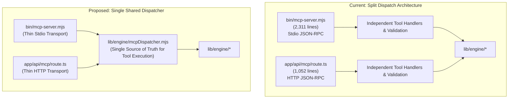

# PhotoNow Codebase Audit: Dead Code, Duplication, and Technical Debt Analysis

> **Comprehensive code audit and refactoring roadmap covering dead code, duplicate logic, redundant API queries, architectural complexity, and technical debt reduction across the PhotoNow engine and companion workbench.**

---

## Executive Summary

This audit examined every source file, component, test, configuration, and documentation file across the repository (18 engine files, 9 UI components, 9 library helpers, 2 API routes, stdio MCP server, and test fixtures). 

The codebase has strong architectural foundations (100% local-first, zero cloud dependencies, non-destructive safety guards, and strict token efficiency). However, rapid feature development from early prototypes to the 29-tool Master Performance Platform has accumulated notable technical debt:

* **Triple-Redundant Project Scans**: The UI's Asset Graph tab invokes 3 parallel HTTP POST calls, triggering 3 redundant AST parses and 3 full disk scans.
* **Duplicated Tool Dispatch (~1,500 lines)**: `bin/mcp-server.mjs` and `app/api/mcp/route.ts` separately implement identical tool argument parsing, engine routing, and error handling.
* **Triplicate Utility Functions**: `formatBytes`, `pathExists`, and path normalization routines are independently implemented in 3 to 4 distinct files.
* **Simulated Infrastructure**: `lib/loadBalancer.ts` simulates an in-memory cluster of 3 nodes with fake latency metrics that resets on serverless cold starts.
* **Legacy Prototype Components**: `AgenticPanel.tsx` and `parseAgentPrompt()` use string regex matching from early prototypes, which is now superseded by the native 29-tool MCP server and `PerformanceWorkbench.tsx`.

---

## 1. Dead Code

### 1.1. Unused Imports in `lib/engine/cache.mjs`
* **Location**: [`lib/engine/cache.mjs`](file:///c:/Users/sibas/OneDrive/Desktop/Projects/photoNow/lib/engine/cache.mjs#L8-L9)
* **Code**: `import fs from 'fs';` and `import path from 'path';`
* **Why Unnecessary**: `EngineCache` is a pure in-memory `Map` store. Neither `fs` nor `path` is ever referenced in the file.
* **Impact of Removal**: Minor bundle size reduction and eliminates dead imports.
* **Risks**: None (0 references in file).
* **Recommended Plan**: Remove lines 8 and 9 from `lib/engine/cache.mjs`.

### 1.2. Abandoned One-Off Test Script: `tests/run-sandbox-demo.mjs`
* **Location**: [`tests/run-sandbox-demo.mjs`](file:///c:/Users/sibas/OneDrive/Desktop/Projects/photoNow/tests/run-sandbox-demo.mjs) (324 lines, 14.8 KB)
* **Why Unnecessary**: Created for a previous ad-hoc demo request. It is not included in `package.json` test scripts (`npm test`). Its logic is completely superseded by `tests/test-performance-engine.mjs` and `tests/test-autonomous-mission.mjs`.
* **Impact of Removal**: Removes 324 lines of unmaintained test code and eliminates generation of temporary files in `tests/sandbox_demo/`.
* **Risks**: None. All features are covered by standardized unit and integration test suites.
* **Recommended Plan**: Delete `tests/run-sandbox-demo.mjs` and purge `tests/sandbox_demo/`.

### 1.3. Untracked Artifact in Root: `tsconfig.tsbuildinfo`
* **Location**: `tsconfig.tsbuildinfo` (115.6 KB)
* **Why Unnecessary**: Compiler cache artifact sitting untracked in the project root. `.gitignore` already contains `*.tsbuildinfo`.
* **Impact of Removal**: Frees 115 KB in workspace.
* **Risks**: None.
* **Recommended Plan**: Delete `tsconfig.tsbuildinfo`.

---

## 2. Duplicate Logic to Consolidate

### 2.1. Triplicate `formatBytes` Implementation
* **Locations**:
  1. [`lib/utils.ts`](file:///c:/Users/sibas/OneDrive/Desktop/Projects/photoNow/lib/utils.ts#L9-L16)
  2. [`lib/engine/tokenEconomy.mjs`](file:///c:/Users/sibas/OneDrive/Desktop/Projects/photoNow/lib/engine/tokenEconomy.mjs#L8-L15)
  3. [`bin/mcp-server.mjs`](file:///c:/Users/sibas/OneDrive/Desktop/Projects/photoNow/bin/mcp-server.mjs#L155-L162)
* **Why Unnecessary**: Three separate implementations of standard byte-to-human-readable formatting (`k = 1024`, sizes array, logarithm calculation). If formatting rules or decimal precisions change, they must be updated in 3 places.
* **Impact of Removal**: Establishes single source of truth and prevents formatting divergence.
* **Risks**: Very low. Requires importing from `lib/engine/tokenEconomy.mjs` or `lib/utils.ts`.
* **Recommended Plan**: Consolidate `formatBytes` in `lib/engine/tokenEconomy.mjs`, re-export in `lib/utils.ts`, and import into `bin/mcp-server.mjs`.

### 2.2. Quadruplicate `pathExists` Helper
* **Locations**:
  1. [`lib/engine/projectScanner.mjs`](file:///c:/Users/sibas/OneDrive/Desktop/Projects/photoNow/lib/engine/projectScanner.mjs#L60-L66)
  2. [`lib/engine/patchGenerator.mjs`](file:///c:/Users/sibas/OneDrive/Desktop/Projects/photoNow/lib/engine/patchGenerator.mjs#L17-L23)
  3. [`lib/engine/regression.mjs`](file:///c:/Users/sibas/OneDrive/Desktop/Projects/photoNow/lib/engine/regression.mjs#L16-L22)
  4. [`lib/engine/budget.mjs`](file:///c:/Users/sibas/OneDrive/Desktop/Projects/photoNow/lib/engine/budget.mjs#L8-L14)
* **Why Unnecessary**: All four files contain the exact identical async wrapper:
  ```javascript
  async function pathExists(p) {
    try { await fs.access(p); return true; } catch { return false; }
  }
  ```
* **Impact of Removal**: Eliminates 24 lines of boilerplate and ensures consistent filesystem checking.
* **Risks**: None.
* **Recommended Plan**: Move `pathExists` into a shared `lib/engine/fsUtils.mjs` and import across all engine modules.

### 2.3. Quadruplicate FFmpeg / FFprobe Path Initialization
* **Locations**:
  1. `bin/mcp-server.mjs` (L44-47)
  2. `tests/test-mcp-server.mjs` (L27-30)
  3. `tests/test-performance-engine.mjs` (L18-21)
  4. `tests/run-sandbox-demo.mjs` (L31-34)
* **Why Unnecessary**: Same 4-line snippet resolving `@ffmpeg-installer/ffmpeg` and `@ffprobe-installer/ffprobe` paths and binding them to `fluent-ffmpeg`.
* **Impact of Removal**: Centralizes binary path discovery.
* **Risks**: Low.
* **Recommended Plan**: Create `lib/engine/ffmpegConfig.mjs` that configures `fluent-ffmpeg` on import.

---

## 3. Unused / Prototype UI Components

### 3.1. `AgenticPanel.tsx` (Early Regex-Based Prototype)
* **Location**: [`components/AgenticPanel.tsx`](file:///c:/Users/sibas/OneDrive/Desktop/Projects/photoNow/components/AgenticPanel.tsx) (318 lines, 12.5 KB) and [`lib/mcpTools.ts`](file:///c:/Users/sibas/OneDrive/Desktop/Projects/photoNow/lib/mcpTools.ts#L614-L673) (`parseAgentPrompt`)
* **Why Unnecessary**: 
  - `AgenticPanel` was built during the initial hackathon phase to simulate an "AI Agent" using basic regex string matching (`prompt.includes('sketch')`, `prompt.match(/(\d+)%/)`).
  - PhotoNow now features a real 29-tool MCP server (`bin/mcp-server.mjs`), a real JSON-RPC playground (`McpPlayground.tsx`), and a full Agentic Performance Workbench (`PerformanceWorkbench.tsx`).
  - Keeping a toy regex simulator alongside real MCP tooling confuses users about whether PhotoNow uses real AI or regex tricks.
* **Impact of Removal**: 
  - Removes 318 lines from `components/` and 60 lines from `lib/mcpTools.ts`.
  - Cleans up tab bar in `HeaderNav.tsx` and `app/page.tsx`.
* **Risks**: Low. If users enjoy the prompt input bar, it can be re-routed to call the actual `/api/mcp` endpoint instead of regex string parsing.
* **Recommended Plan**: Either retire `AgenticPanel.tsx` or upgrade it to dispatch real JSON-RPC calls to `/api/mcp`.

---

## 4. Overly Complex Implementations to Simplify

### 4.1. Simulated In-Memory Cluster in `lib/loadBalancer.ts`
* **Location**: [`lib/loadBalancer.ts`](file:///c:/Users/sibas/OneDrive/Desktop/Projects/photoNow/lib/loadBalancer.ts) (165 lines, 4.7 KB)
* **Why Unnecessary**:
  - Simulates a 3-node distributed cluster (`mcp-node-core-01`, `mcp-node-edge-02`, `mcp-node-stream-03`) with weighted round-robin and least-connections dispatching.
  - In reality, all requests execute in the exact same Node.js process on the local machine or serverless container.
  - In a serverless environment (Vercel), in-memory counters reset on every cold start.
  - Adds overhead and header bloat (`X-Load-Balancer-Nodes`, `X-Load-Balancer-Strategy`).
* **Impact of Removal**:
  - Removes 165 lines of mock clustering code.
  - Simplifies `/api/mcp/route.ts` request lifecycle.
* **Risks**: The UI component `components/McpPlayground.tsx` displays telemetry from `loadBalancer`. Removing it requires cleaning up the telemetry display in `McpPlayground.tsx`.
* **Recommended Plan**: Replace the complex simulated cluster with a simple lightweight request counter or pass-through handler, keeping the UI telemetry display accurate.

---

## 5. Redundant Database Queries & API Calls

### 5.1. Triple Scan on Asset Graph Tab Click
* **Location**: [`components/PerformanceWorkbench.tsx`](file:///c:/Users/sibas/OneDrive/Desktop/Projects/photoNow/components/PerformanceWorkbench.tsx#L55-L71) and [`app/api/performance/route.ts`](file:///c:/Users/sibas/OneDrive/Desktop/Projects/photoNow/app/api/performance/route.ts#L40-L55)
* **The Problem**:
  When a user clicks `[2. ASSET GRAPH & UNUSED]`, the frontend executes:
  ```typescript
  const [resGraph, resUnused, resShared] = await Promise.all([
    fetch('/api/performance', { body: JSON.stringify({ action: 'graph', targetPath }) }),
    fetch('/api/performance', { body: JSON.stringify({ action: 'unused', targetPath }) }),
    fetch('/api/performance', { body: JSON.stringify({ action: 'shared', targetPath }) }),
  ]);
  ```
  On the server (`/api/performance`), each of those 3 actions executes:
  ```typescript
  const structure = await scanProjectStructure(targetPath);
  const sourceRefs = await scanProjectSourceReferences(targetPath, structure.publicDir);
  const analysis = await analyzeWebAssets(targetPath);
  const graph = buildAssetGraph(targetPath, analysis.assets, sourceRefs);
  ```
  **The entire disk project structure is scanned 3 times, all source code is parsed 3 times, all images are analyzed 3 times, and the graph is constructed 3 times simultaneously.**
* **Impact of Removal**: 
  - Reduces server CPU and disk I/O on that tab by **66%**.
  - Speeds up tab load time by ~3x.
* **Risks**: None.
* **Recommended Plan**: Consolidate into a single API call `{ action: 'graph_complete', targetPath }` returning `{ success: true, graph: graph.toJSON(), unused: graph.findUnusedAssets(), shared: graph.findSharedAssets() }`.

---

## 6. Legacy / Outdated Documentation Files

### 6.1. Outdated `MCP_PLUG_AND_PLAY.md`
* **Location**: [`MCP_PLUG_AND_PLAY.md`](file:///c:/Users/sibas/OneDrive/Desktop/Projects/photoNow/MCP_PLUG_AND_PLAY.md)
* **Why Unnecessary**: Contains outdated paths pointing to the old project directory `photoConvert` (`"c:/Users/sibas/OneDrive/Desktop/Projects/photoConvert/bin/mcp-server.mjs"`). Completely superseded by [`HOW_TO_USE_MCP_AND_UI.md`](file:///c:/Users/sibas/OneDrive/Desktop/Projects/photoNow/HOW_TO_USE_MCP_AND_UI.md) and [`PHOTONOW_PERFORMANCE_ENGINE.md`](file:///c:/Users/sibas/OneDrive/Desktop/Projects/photoNow/PHOTONOW_PERFORMANCE_ENGINE.md).
* **Impact of Removal**: Prevents developer confusion and eliminates conflicting setup instructions.
* **Risks**: None.
* **Recommended Plan**: Delete `MCP_PLUG_AND_PLAY.md` or redirect it to `HOW_TO_USE_MCP_AND_UI.md`.

---

## 7. Major Opportunities to Reduce Technical Debt

### 7.1. Duplicated MCP Tool Dispatch Architecture (~1,500 lines)



* **The Problem**:
  - `bin/mcp-server.mjs` (2,311 lines) and `app/api/mcp/route.ts` (1,052 lines) contain parallel implementations for all 29 tools.
  - Adding or updating any tool argument, return shape, or validation requires editing both files independently.
* **Recommended Plan**:
  - Extract tool dispatch logic into `lib/engine/mcpDispatcher.mjs`.
  - Both `bin/mcp-server.mjs` and `app/api/mcp/route.ts` call `dispatchMcpTool(toolName, toolArgs)`.
  - Eliminates ~1,500 lines of duplicated code while ensuring 100% parity between stdio and HTTP.

---

## Prioritized Action Plan

| Priority | Action | Estimated Savings | Risk |
| :--- | :--- | :--- | :--- |
| **P0 (Immediate)** | Fix triple-scan API calls in `PerformanceWorkbench.tsx` & `/api/performance` | 66% faster tab load, eliminates 2 redundant disk scans | Zero |
| **P0 (Immediate)** | Remove dead imports in `lib/engine/cache.mjs` and delete untracked `tsconfig.tsbuildinfo` | Cleaner build | Zero |
| **P1 (High)** | Consolidate `formatBytes` and `pathExists` into shared utilities | Eliminates duplicate logic in 7 files | Very Low |
| **P1 (High)** | Delete obsolete `tests/run-sandbox-demo.mjs` and purge old `MCP_PLUG_AND_PLAY.md` | -450 lines of stale code | Zero |
| **P2 (Medium)** | Extract shared `mcpDispatcher.mjs` to unify `bin/mcp-server.mjs` and `app/api/mcp/route.ts` | Eliminates ~1,500 lines of duplicated dispatch code | Low (verified by existing 29-tool test suite) |
| **P2 (Medium)** | Simplify simulated `lib/loadBalancer.ts` or connect it to real concurrency controls | Simplifies API route, removes 165 lines of mock code | Low |
