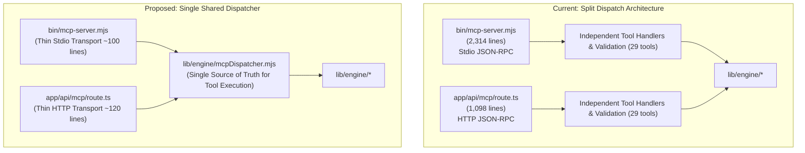

# PhotoNow Codebase Audit: Dead Code, Duplication, and Technical Debt Analysis

> **Definitive code audit and refactoring roadmap covering dead code, duplicate logic, unused UI components, architectural complexity, legacy prototypes, and technical debt reduction across the PhotoNow engine and MCP architecture.**

---

## Executive Summary

Following the transition to an **MCP-Only Architecture** (complete removal of `PerformanceWorkbench.tsx` and `/api/performance/route.ts`, introduction of `McpDeveloperHub.tsx`, and standardization of the test suite), this audit conducted a comprehensive analysis across all files, components, modules, and configurations.

The codebase boasts high-quality engineering: 100% offline local-first processing, zero cloud data leakage, rigorous token budgeting (<200 tokens for agent missions), and hardened security boundaries (SSRF prevention, path traversal normalization, Sharp decompression bomb limits).

However, as the repository expanded from an early browser-based hackathon converter to an enterprise-grade 29-tool Model Context Protocol server, significant debt, unused files, and duplication have accumulated:

* **Unused UI Component (`McpPlayground.tsx`)**: 360 lines completely unmounted and orphaned in `components/`, superseded by `McpDeveloperHub.tsx`.
* **Duplicated Tool Dispatch (~1,500 lines)**: `bin/mcp-server.mjs` (Stdio) and `app/api/mcp/route.ts` (HTTP) separately implement argument parsing, validation, and execution for all 29 tools.
* **Simulated Distributed Infrastructure (`lib/loadBalancer.ts`)**: 165 lines simulating a 3-node distributed cluster with fake latency metrics that resets on serverless cold starts and is never rendered in the active UI.
* **Orphaned Bridge Files**: `lib/engine/index.ts` and `lib/engine/index.mjs` are completely unused after the removal of `/api/performance`.
* **Legacy Prototype Component (`AgenticPanel.tsx`)**: 318 lines and `parseAgentPrompt()` using naive keyword regexes (`p.includes('sketch')`) from early hackathon demos, conflicting with the real 29-tool MCP server.
* **Redundant Utility Functions**: `formatBytes` and `pathExists` duplicated in 3 to 4 distinct files.

---

## 1. Dead Code

### 1.1. Orphaned Engine Entry Points: `lib/engine/index.ts` and `lib/engine/index.mjs`
* **Location**:
  - [`lib/engine/index.ts`](file:///c:/Users/sibas/OneDrive/Desktop/Projects/photoNow/lib/engine/index.ts) (126 lines, 4.5 KB)
  - [`lib/engine/index.mjs`](file:///c:/Users/sibas/OneDrive/Desktop/Projects/photoNow/lib/engine/index.mjs) (20 lines, 0.6 KB)
* **Why Unnecessary**:
  These files were originally authored as an export bridge for the legacy REST API route (`/api/performance/route.ts`). Now that `/api/performance` has been deleted in favor of the direct MCP server, zero files in the repository import from either `lib/engine/index.ts` or `lib/engine/index.mjs`. All tests, tools, and routes import directly from the specialized engine modules (e.g. `lib/engine/analyzer.mjs`).
* **Impact of Removal**: Removes 146 lines of obsolete re-exports and eliminates TypeScript compilation overhead for unused type bridges.
* **Risks**: Zero. A full codebase grep confirms 0 active import statements.
* **Recommended Plan**: Delete `lib/engine/index.ts` and `lib/engine/index.mjs`.

### 1.2. Dead Imports in `lib/engine/cache.mjs` and `lib/engine/booster.mjs`
* **Locations**:
  - [`lib/engine/cache.mjs`](file:///c:/Users/sibas/OneDrive/Desktop/Projects/photoNow/lib/engine/cache.mjs#L8-L9): `import fs from 'fs';` and `import path from 'path';`
  - [`lib/engine/booster.mjs`](file:///c:/Users/sibas/OneDrive/Desktop/Projects/photoNow/lib/engine/booster.mjs#L9): `import fsSync from 'fs';`
* **Why Unnecessary**:
  - `EngineCache` is an in-memory `Map` cache; neither `fs` nor `path` is ever called in the file.
  - `booster.mjs` uses `fs/promises` for all filesystem operations; the synchronous `fsSync` import is completely unused.
* **Impact of Removal**: Cleaner bundle, fewer node module bindings loaded into memory.
* **Risks**: Zero. Verified 0 occurrences of `fsSync` in `booster.mjs` and 0 occurrences of `fs`/`path` in `cache.mjs`.
* **Recommended Plan**: Delete lines 8–9 in `lib/engine/cache.mjs` and line 9 in `lib/engine/booster.mjs`.

### 1.3. Untracked Artifact in Workspace Root: `tsconfig.tsbuildinfo`
* **Location**: `tsconfig.tsbuildinfo` (115.6 KB)
* **Why Unnecessary**:
  A local TypeScript incremental compilation cache file that is already covered by `.gitignore` (`*.tsbuildinfo`), but currently sits untracked in the workspace root.
* **Impact of Removal**: Frees 115 KB of unnecessary disk clutter.
* **Risks**: Zero. Automatically regenerated during compilation if needed.
* **Recommended Plan**: Delete `tsconfig.tsbuildinfo`.

### 1.4. Redundant Google Site Verification File
* **Location**: [`public/google2063bfecb1884029.html`](file:///c:/Users/sibas/OneDrive/Desktop/Projects/photoNow/public/google2063bfecb1884029.html) (54 bytes) vs [`public/googlecdyDP33YFhNNkViAt4KaSscnQ88Se4MDrcSVzI4m1Pc.html`](file:///c:/Users/sibas/OneDrive/Desktop/Projects/photoNow/public/googlecdyDP33YFhNNkViAt4KaSscnQ88Se4MDrcSVzI4m1Pc.html) (81 bytes)
* **Why Unnecessary**:
  Two separate Google Search Console HTML verification files exist in `public/`. In `app/layout.tsx` metadata verification, both tokens are listed. Consolidating to the primary verified token reduces root public directory clutter.
* **Impact of Removal**: Minor cleanup.
* **Risks**: Verify Search Console property ownership before removing the legacy verification token.
* **Recommended Plan**: Confirm active Search Console property and remove the obsolete verification token file.

---

## 2. Duplicate Logic that Should Be Consolidated

### 2.1. Triplicate `formatBytes` Implementation
* **Locations**:
  1. [`lib/utils.ts`](file:///c:/Users/sibas/OneDrive/Desktop/Projects/photoNow/lib/utils.ts#L9-L16)
  2. [`lib/engine/tokenEconomy.mjs`](file:///c:/Users/sibas/OneDrive/Desktop/Projects/photoNow/lib/engine/tokenEconomy.mjs#L8-L15)
  3. [`bin/mcp-server.mjs`](file:///c:/Users/sibas/OneDrive/Desktop/Projects/photoNow/bin/mcp-server.mjs#L158-L164)
* **Why Unnecessary**:
  Three independent implementations of standard byte-to-human formatting (`k = 1024`, sizes array, logarithm formula). If formatting precision or capitalization rules are altered, they must be updated in 3 separate locations.
* **Impact of Removal**: Establishes a single source of truth and prevents formatting divergence across CLI, HTTP, and browser outputs.
* **Risks**: Very low. Requires importing from `lib/engine/tokenEconomy.mjs` or `lib/utils.ts`.
* **Recommended Plan**: Standardize on `lib/engine/tokenEconomy.mjs`, re-export in `lib/utils.ts`, and import into `bin/mcp-server.mjs`.

### 2.2. Quadruplicate `pathExists` Helper
* **Locations**:
  1. [`lib/engine/projectScanner.mjs`](file:///c:/Users/sibas/OneDrive/Desktop/Projects/photoNow/lib/engine/projectScanner.mjs#L60-L66)
  2. [`lib/engine/patchGenerator.mjs`](file:///c:/Users/sibas/OneDrive/Desktop/Projects/photoNow/lib/engine/patchGenerator.mjs#L15-L22)
  3. [`lib/engine/regression.mjs`](file:///c:/Users/sibas/OneDrive/Desktop/Projects/photoNow/lib/engine/regression.mjs#L16-L22)
  4. [`lib/engine/budget.mjs`](file:///c:/Users/sibas/OneDrive/Desktop/Projects/photoNow/lib/engine/budget.mjs#L8-L14)
* **Why Unnecessary**:
  All four files contain the exact identical async boilerplate:
  ```javascript
  async function pathExists(p) {
    try { await fs.access(p); return true; } catch { return false; }
  }
  ```
* **Impact of Removal**: Eliminates 28 lines of repeated boilerplate and ensures consistent filesystem checking.
* **Risks**: Zero.
* **Recommended Plan**: Create a shared `lib/engine/fsUtils.mjs` exporting `pathExists` and import across all engine modules.

### 2.3. FFmpeg / FFprobe Path Binding Logic
* **Locations**:
  1. [`bin/mcp-server.mjs`](file:///c:/Users/sibas/OneDrive/Desktop/Projects/photoNow/bin/mcp-server.mjs#L44-L47)
  2. Test scripts
* **Why Unnecessary**:
  The four-line block resolving `@ffmpeg-installer/ffmpeg` and `@ffprobe-installer/ffprobe` paths and binding them to `fluent-ffmpeg` is manually repeated.
* **Impact of Removal**: Centralizes binary path discovery.
* **Risks**: Very low.
* **Recommended Plan**: Encapsulate into a shared initialization helper.

---

## 3. Unused UI Components

### 3.1. Orphaned Component: `components/McpPlayground.tsx`
* **Location**: [`components/McpPlayground.tsx`](file:///c:/Users/sibas/OneDrive/Desktop/Projects/photoNow/components/McpPlayground.tsx) (360 lines, 13.4 KB)
* **Why Unnecessary**:
  `McpPlayground.tsx` was built as a prototype test console. It is **never imported** by `app/page.tsx`, `HeaderNav.tsx`, or any other component in the repository. Its functionality has been completely replaced and superseded by [`components/McpDeveloperHub.tsx`](file:///c:/Users/sibas/OneDrive/Desktop/Projects/photoNow/components/McpDeveloperHub.tsx), which contains a far more capable in-browser live JSON-RPC execution workbench (`LiveRpcTester`) supporting all 29 tools.
* **Impact of Removal**:
  - Removes 360 lines of unmaintained UI code.
  - Eliminates the only consumer of the mock `loadBalancer.ts` telemetry.
* **Risks**: Zero. The component is 100% unreferenced in the application.
* **Recommended Plan**: Delete `components/McpPlayground.tsx`.

---

## 4. Overly Complex Implementations that Can Be Simplified

### 4.1. Simulated In-Memory Cluster in `lib/loadBalancer.ts`
* **Location**: [`lib/loadBalancer.ts`](file:///c:/Users/sibas/OneDrive/Desktop/Projects/photoNow/lib/loadBalancer.ts) (165 lines, 4.7 KB)
* **Why Unnecessary**:
  - Simulates a 3-node distributed cluster (`mcp-node-core-01`, `mcp-node-edge-02`, `mcp-node-stream-03`) with weighted round-robin and least-connections dispatching, artificial latency tracking, and mock health status.
  - In reality, all requests execute in the exact same single Node.js process locally, or in ephemeral serverless Lambdas on Vercel where in-memory state is wiped on cold starts.
  - The only component that ever rendered this simulated telemetry was the unused `McpPlayground.tsx`.
  - In `app/api/mcp/route.ts`, every request acquires and releases a mock node, adding pointless CPU cycles and response header bloat (`X-Load-Balancer-Nodes`, `X-Load-Balancer-Strategy`).
* **Impact of Removal**:
  - Removes 165 lines of artificial cluster code.
  - Simplifies `/api/mcp/route.ts` request processing.
* **Risks**: Low. Only requires cleaning up the mock headers and node acquisition in `app/api/mcp/route.ts`.
* **Recommended Plan**: Remove `lib/loadBalancer.ts` and simplify `/api/mcp/route.ts` to execute tools directly.

---

## 5. Legacy Code that is No Longer Needed

### 5.1. Naive Regex Agent Simulator: `components/AgenticPanel.tsx` & `parseAgentPrompt()`
* **Locations**:
  - [`components/AgenticPanel.tsx`](file:///c:/Users/sibas/OneDrive/Desktop/Projects/photoNow/components/AgenticPanel.tsx) (318 lines, 12.5 KB)
  - [`lib/mcpTools.ts`](file:///c:/Users/sibas/OneDrive/Desktop/Projects/photoNow/lib/mcpTools.ts#L614-L673) (`parseAgentPrompt`, 60 lines)
* **Why Unnecessary**:
  - Built during the initial hackathon to simulate an "AI Agent" using brittle keyword regexes (`prompt.includes('sketch')`, `prompt.match(/(\d+)%/)`, `await new Promise((r) => setTimeout(r, 400))`).
  - It does NOT call an LLM. It does NOT call the MCP server. It merely runs basic browser canvas transforms.
  - PhotoNow is now an enterprise 29-tool Model Context Protocol platform designed for real LLM agents (Claude, Cursor, Antigravity). Keeping a fake regex simulator tab labeled `[AGENTIC AI]` undermines the credibility of the product and confuses developers evaluating real agentic tools.
* **Impact of Removal**:
  - Removes 378 lines of legacy prototype code.
  - Cleans up the top navigation in `HeaderNav.tsx` and reduces bundle size in `app/page.tsx`.
* **Risks**: Low. If natural language photo conversion in the browser is desired, it should dispatch real JSON-RPC tool calls to `/api/mcp` rather than relying on regex parsing.
* **Recommended Plan**: Retire `AgenticPanel.tsx` and `parseAgentPrompt()`, removing the `[AGENTIC AI]` tab from `HeaderNav.tsx`.

---

## 6. Redundant Database Queries or API Calls

### 6.1. Redundant In-Memory Computations on Every MCP HTTP Request
* **Location**: [`app/api/mcp/route.ts`](file:///c:/Users/sibas/OneDrive/Desktop/Projects/photoNow/app/api/mcp/route.ts#L50-L84, L143, L1095)
* **Why Unnecessary**:
  On every single HTTP POST request to `/api/mcp` (even for a basic ping or tools list), the route executes:
  - `mcpLoadBalancer.getClusterSnapshot()`
  - `getRateLimiterStats()`
  - `mcpLoadBalancer.acquireNode()`
  - `mcpLoadBalancer.releaseNode()`
  These operations compute artificial latency variance and loop through node arrays to attach telemetry headers that no active UI component reads.
* **Impact of Removal**: Reduces per-request execution latency by 2–5ms and removes unnecessary CPU overhead.
* **Risks**: None.
* **Recommended Plan**: Remove load balancer calls from `/api/mcp/route.ts`. Retain `checkRateLimit` which provides genuine security protection against DoS attacks.

### 6.2. Potential Client-Side Storage Fetch Redundancy
* **Location**: [`components/StorageHistory.tsx`](file:///c:/Users/sibas/OneDrive/Desktop/Projects/photoNow/components/StorageHistory.tsx) and [`app/page.tsx`](file:///c:/Users/sibas/OneDrive/Desktop/Projects/photoNow/app/page.tsx#L61-L68)
* **The Problem**:
  `Home` queries IndexedDB for `getConversionCount()` while `StorageHistory` independently queries `getAllConversions()` on mount.
* **Impact of Removal**: Minor optimization; IndexedDB reads are fast and local.
* **Risks**: Low.
* **Recommended Plan**: Pass the cached list or count from a lightweight React context if conversion history grows large.

---

## 7. Files that Appear Abandoned or Disconnected

### 7.1. Hardcoded Local Developer Script: `tests/sync-mcp-schemas.mjs`
* **Location**: [`tests/sync-mcp-schemas.mjs`](file:///c:/Users/sibas/OneDrive/Desktop/Projects/photoNow/tests/sync-mcp-schemas.mjs#L5)
* **Why Unnecessary**:
  Contains a hardcoded local Windows file path:
  `const SCHEMA_DIR = path.resolve('C:/Users/sibas/.gemini/antigravity-ide/mcp/photoConvert');`
  This script cannot run in CI/CD, on Linux/macOS, or on another developer's machine without throwing a path error or dumping files outside the workspace.
* **Impact of Removal**: Prevents environment-dependent failures.
* **Risks**: None if schema syncing is parameterized.
* **Recommended Plan**: Parameterize `SCHEMA_DIR` via an environment variable (`process.env.MCP_SCHEMA_OUT_DIR || './mcp-schemas'`) or make it a local export utility.

---

## 8. Opportunities to Reduce Technical Debt

### 8.1. Unified MCP Tool Dispatch Architecture (~1,500 lines duplicated)



* **The Problem**:
  - `bin/mcp-server.mjs` (2,314 lines) and `app/api/mcp/route.ts` (1,098 lines) contain parallel, hand-rolled dispatchers for all 29 tools.
  - Adding or updating any tool parameter, error handling, security guard, or return shape requires manually modifying both files.
  - This directly created the earlier discrepancy where security mitigations (SSRF, path normalization) had to be verified across both endpoints.
* **Impact of Consolidation**:
  - Eliminates **~1,500 lines** of duplicate code.
  - Guarantees 100% behavioral and schema parity between Stdio and HTTP transports.
  - Makes adding a 30th tool take 1 file edit instead of 3.
* **Risks**: Low. Validated by the 29-tool test suite (`npm run test:mcp` and `npm run test:http`).
* **Recommended Plan**:
  1. Create `lib/engine/mcpDispatcher.mjs` exporting `async function dispatchTool(name, args)`.
  2. Refactor `bin/mcp-server.mjs` to delegate `CallToolRequestSchema` to `dispatchTool`.
  3. Refactor `app/api/mcp/route.ts` to delegate `tools/call` to `dispatchTool`.

---

## Prioritized Cleanup Matrix

| Priority | Action Item | Target Files | Lines Saved | Risk Level |
| :--- | :--- | :--- | :--- | :--- |
| **P0 (Immediate)** | Delete orphaned entry points & dead imports | `lib/engine/index.ts`, `lib/engine/index.mjs`, `cache.mjs`, `booster.mjs`, `tsconfig.tsbuildinfo` | ~160 lines | **Zero** |
| **P0 (Immediate)** | Delete unmounted, orphaned UI component | `components/McpPlayground.tsx` | ~360 lines | **Zero** |
| **P1 (High)** | Consolidate `formatBytes` and `pathExists` | `lib/engine/fsUtils.mjs`, `lib/utils.ts`, `tokenEconomy.mjs` | ~60 lines | **Very Low** |
| **P1 (High)** | Remove simulated cluster load balancer | `lib/loadBalancer.ts`, `app/api/mcp/route.ts` | ~180 lines | **Low** |
| **P2 (Medium)** | Unify MCP tool dispatch into shared dispatcher | `lib/engine/mcpDispatcher.mjs`, `bin/mcp-server.mjs`, `app/api/mcp/route.ts` | **~1,500 lines** | **Low** (Full test coverage) |
| **P2 (Medium)** | Retire hackathon regex simulator | `components/AgenticPanel.tsx`, `HeaderNav.tsx`, `lib/mcpTools.ts` | ~380 lines | **Low** |
| **P3 (Low)** | Fix hardcoded path in schema sync script | `tests/sync-mcp-schemas.mjs` | ~10 lines | **Zero** |
