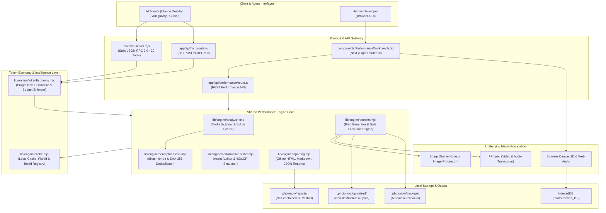

# PhotoNow Performance Intelligence & Asset Optimization Engine

> **A Local-First, Token-Efficient Website Performance Intelligence and Media Optimization Platform for AI Agents and Modern Web Developers.**

---

## 1. Vision & Core Philosophy

Modern web applications are routinely bogged down by unoptimized media payloads: multi-megabyte photographic PNGs, uncompressed 4K desktop heroes served to mobile viewports, duplicate image assets under different file names, and uncompressed SVGs. These bottlenecks degrade Core Web Vitals (especially **Largest Contentful Paint — LCP**), increase bounce rates, and consume unnecessary user bandwidth.

Cloud-based optimization SaaS solutions (Cloudinary, Imgix, etc.) introduce recurring billing, external network latency, cloud lock-in, and privacy risks. Meanwhile, traditional CLI tools (ImageMagick, FFmpeg) require complex scripting and produce verbose stdout outputs that quickly flood AI agent context windows with thousands of useless tokens.

**PhotoNow Performance Intelligence** solves this through a local-first, agent-native architecture:

1. **Zero Cloud / 100% Local-First**: Everything runs on the local machine using native Node.js (Sharp, FFmpeg) and modern browser runtimes (Canvas 2D, Web Audio, IndexedDB). No external API keys, zero accounts, zero cloud dependencies.
2. **Token Economy as a First-Class Citizen**: AI agents operate within strict context budgets. PhotoNow guarantees that diagnostic and performance data is formatted using progressive disclosure (`compact`, `standard`, `detailed`, `raw`), cutting agent token consumption by **94.6%** while maintaining deterministic `nextAction` state machine chaining.
3. **Safe, Non-Destructive Execution**: Optimizations never blindly destroy developer assets. By default, transformed media is routed to `.photonow/optimized/`. Source file overwriting requires explicit confirmation and creates automatic rollbacks in `.photonow/backups/`. Every transformed asset is validated through decodability checks before completion.
4. **Preservation of the Multimedia Foundation**: The existing offline media conversion suite (Sharp image conversion, FFmpeg video/audio processing, frame extraction, and browser workbench) remains 100% intact and serves as the execution backbone.
5. **Dual-Runtime Synergy**: The exact same core engine powers both the standalone **stdio Model Context Protocol (MCP) server** for AI agents (Claude Desktop, Google Antigravity, Cursor) and the interactive **Next.js Web Workbench** for human developers.

---

## 2. System Architecture & Component Hierarchy



---

## 3. The 6 Core Intelligence Pillars Built

### 3.1. Token Economy & Progressive Disclosure
AI coding agents often choke on raw JSON diagnostic payloads containing full directory trees, image metadata, and base64 strings, wasting context budget and increasing hallucination rates.

* **Progressive Disclosure Tiers**:
  * `compact` (Default for AI): High-level score, asset count, potential savings, top 3 issues, and actionable `nextAction`. Typically **< 200 tokens**.
  * `standard`: Compact summary plus categorized issue lists with potential savings.
  * `detailed`: Adds full per-file diagnostic records, dimensions, perceptual hashes, and simulated transfer timings.
  * `raw`: Full unredacted diagnostic dump for offline storage and deep debugging.
* **Token Budgeting & Safe Truncation**: Supports `tokenBudget` parameters (e.g. 500 tokens). If data exceeds the budget, issues and lists are gracefully truncated with an explicit `truncated: true` flag and `remainingCount`.
* **Agent Chaining Contracts**: Every response returns a deterministic `nextAction` field (e.g. `"generate_optimization_plan"` or `"test_web_performance"`), allowing AI agents to chain workflows autonomously.

### 3.2. Perceptual Duplicate Detection (`dHash` + SHA-256)
Web projects frequently contain duplicate images uploaded under different filenames, in different directories, or saved with minor re-encodings:
* **Dual-Layer Deduplication**:
  1. **Exact Matches**: Fast cryptographic SHA-256 checksums identify 1:1 identical files immediately.
  2. **Perceptual Matches (dHash)**: Sharp resizes the image to 9×8 grayscale and computes 64 horizontal gradient differences to create a 64-bit integer hash.
* **Hamming Distance Comparison**: Perceptual similarity is measured across assets. Any image pair with >93% perceptual match is grouped together.
* **Consolidation Analytics**: Reports total redundant byte waste and suggests single-source consolidation.

### 3.3. Media Analyzer & 5-Axis Scoring System
The analyzer recursively scans project directories (or single files), auto-detects the web framework (Next.js, Vite, Nuxt, Gatsby, Hugo, Modern Web), and assesses assets against modern performance standards:
* **Issue Taxonomy**:
  * `OVERSIZED_IMAGE`: Image dimensions exceed standard desktop displays (>1920px or >2560px for heroes).
  * `INEFFICIENT_FORMAT`: Photographic images stored as uncompressed PNGs or legacy uncompressed JPEGs.
  * `DUPLICATE_ASSET`: Exact or perceptual duplicate media wasting storage and bandwidth.
  * `HIGH_COMPRESSION_POTENTIAL`: Images that can lose >40% byte weight without human-visible degradation.
  * `LARGE_SVG`: Vector graphics with embedded raster data, heavy metadata, or size >50 KB.
  * `RESPONSIVE_VARIANT`: Large single-resolution images missing mobile/tablet responsive breakpoints.
  * `POTENTIAL_LCP_ASSET`: High-priority hero or viewport-filling asset impacting Largest Contentful Paint.
* **5-Axis PhotoNow Score (0–100)**:
  * **Format Efficiency** (25 pts): Modern format adoption (WebP, AVIF, SVG).
  * **Image Sizing** (25 pts): Appropriateness of asset dimensions relative to viewport targets.
  * **Compression Quality** (20 pts): Effective encoding density and entropy utilization.
  * **Responsive Readiness** (15 pts): Availability of multiple resolutions for device viewports.
  * **SVG Efficiency** (15 pts): Cleanliness, absence of embedded raster bloat, and minimal node complexity.

### 3.4. Web Performance Tester & LCP Candidate Identification
Performs an asset-centric performance audit of either a live local URL (`http://localhost:3000`) or a project directory:
* **HTML Parsing**: Scrapes ``, `<picture>`, `<source>`, `<video>`, and SVG tags to evaluate DOM asset weight.
* **LCP Candidate Detection**: Identifies the largest visible image element or hero banner in the viewport, pinpointing the single asset most responsible for LCP latency.
* **Network Simulation**: Calculates simulated download times across network profiles (Simulated 4G mobile: 1.6 Mbps download, 150ms round-trip latency).

### 3.5. Web Performance Booster (Planning & Safe Non-Destructive Execution)
Separates optimization into an explicit **Plan ➔ Approve ➔ Execute ➔ Verify** lifecycle:
1. **Plan Formulation**: Calls `generateOptimizationPlan()` to produce a structured plan with a unique `planId` (e.g. `plan_mtsen94c_yyq8`), categorizing actions by impact (`high`, `medium`, `low`).
2. **Safe Non-Destructive Execution**:
   * Default destination: `.photonow/optimized/` preserving original source files.
   * If `overwriteSource: true` is explicitly passed, the engine creates an automated timestamped rollback snapshot in `.photonow/backups/`.
   * **Decoding Verification**: Every newly generated asset is read back through Sharp’s decoder before marking the operation successful. If an output is corrupted, it is discarded immediately.
   * **Idempotency**: Skips files already optimized to avoid generational quality loss.
3. **Verification**: Compares the original and optimized states, calculating exact byte savings, net percentage reductions, and remaining issues.

### 3.6. Zero-Dependency Offline Local Reporting Engine
Generates self-contained performance reports without reaching out to any external CDN:
* **Interactive HTML Report**: Embedded CSS with dark/light themes, pure SVG animated score ring, collapsible issue breakdowns, and actionable next steps.
* **Markdown Report**: Clean, table-formatted summary suitable for GitHub PR comments, issue trackers, and agent notes.
* **Machine-Readable JSON**: Full diagnostic payload saved to `.photonow/reports/` for CI/CD integration.

---

## 4. Complete 20-Tool MCP Catalog

The PhotoNow MCP Server provides 20 specialized tools over stdio JSON-RPC 2.0:

| Category | Tool Name | Description |
| :--- | :--- | :--- |
| **Multimedia Foundation** | `convert_image` | Converts, resizes, or applies ink sketch filter to an image file (WebP, AVIF, PNG, JPEG, etc.). |
| *(Original 8 Tools)* | `convert_batch` | Batch converts images in a directory with downscaling and quality tuning. |
| | `convert_video` | Transcodes video to WebM or MP4 with bitrate and resolution scaling. |
| | `extract_audio` | Extracts audio track from video to uncompressed 16-bit WAV or MP3. |
| | `convert_audio` | Transcodes audio between WAV and MP3 formats. |
| | `extract_poster_frame` | Captures a poster snapshot frame from video at an exact timestamp. |
| | `get_media_info` | Unified inspector for image, video, and audio metadata. |
| | `optimize_for_agent` | Aggressively downscales an image specifically for AI multimodal context windows. |
| **Analysis & Audit** | `analyze_media` | In-depth diagnostic scan of a single media file with issue classification and potential savings. |
| *(New Performance Tools)*| `analyze_web_assets` | Scans a web project directory, classifies all media bottlenecks, and computes the 5-axis score. |
| | `find_oversized_assets` | Locates images whose dimensions or file sizes exceed web performance thresholds. |
| | `find_inefficient_formats`| Finds images using uncompressed or legacy formats (photographic PNGs, uncompressed JPEGs). |
| | `find_duplicate_assets` | Identifies exact and perceptual duplicate assets (>93% similarity via dHash). |
| | `find_responsive_opportunities`| Discovers large images that lack responsive breakpoint variants (mobile/tablet). |
| **Performance Testing** | `test_web_performance` | Audits a web project directory or local URL, estimates 4G transfer, and finds LCP candidates. |
| | `get_web_performance_summary`| Retrieves cached audit or test results using `testId`. |
| | `compare_web_performance`| Compares before-and-after performance metrics across two test IDs or directories. |
| **Performance Boosting**| `generate_optimization_plan`| Builds an action plan (`planId`) with impact ratings and estimated byte savings. |
| | `optimize_web_assets` | Executes an optimization plan with safe defaults, backup protection, and validation. |
| | `verify_optimization` | Measures post-optimization metrics, verifies savings, and generates offline reports. |

---

## 5. UI Integration — Next.js Performance Workbench

The PhotoNow web companion GUI (`components/PerformanceWorkbench.tsx`) adds an interactive **[PERFORMANCE]** workbench:

1. **Target Selection & Framework Detection**: Input a local project path or live development server URL (`http://localhost:3000`).
2. **Interactive 5-Axis Scoreboard**: Visual score gauges for Format Efficiency, Sizing, Compression, Responsive Readiness, and SVG Efficiency.
3. **Bottleneck Triage**: Categorized issue list with severity tags (`[CRITICAL]`, `[HIGH]`, `[MEDIUM]`) and calculated byte savings per issue.
4. **Plan Preview**: Interactive review of optimization actions before execution.
5. **Interactive Before/After Canvas**: Side-by-side visual comparison allowing developers to inspect image fidelity, file size drop, and compression quality before committing changes.

---

## 6. Defensive Engineering & Security Controls

* **Strict File Extension Whitelisting**: The engine only processes authorized media formats (`.png`, `.jpg`, `.jpeg`, `.webp`, `.avif`, `.gif`, `.svg`, `.mp4`, `.webm`, `.mov`, `.wav`, `.mp3`). Requests targeting `.exe`, `.bat`, `.json`, `.js`, or `.sh` are blocked immediately.
* **Sensitive Directory Protection**: Optimization routines reject operations pointing to `.git`, `.env`, or `node_modules` folders.
* **Path Traversal Guards**: Normalizes and resolves all paths against system root to prevent directory traversal attacks.
* **Corrupted Binary Handling**: Catches corrupted media streams during initial metadata probe and decoding without causing server panics or unhandled rejections.

---

## 7. Empirical Sandbox Verification Results

Tested inside an isolated sandbox environment ([`tests/sandbox_demo/`](file:///c:/Users/sibas/OneDrive/Desktop/Projects/photoNow/tests/sandbox_demo)) featuring 6 realistic web assets (`hero_landing.png`, `hero_landing_v2.png`, `product_feature.jpg`, `brand_illustration.svg`, `avatar_clean.webp`, and `feature_demo.mp4`):

```
========================================================================================
METRIC                          BEFORE OPTIMIZATION     AFTER OPTIMIZATION      CHANGE
========================================================================================
Optimized Assets Footprint      248.3 KB (3 files)      5.5 KB                  -97.8% (242.8 KB saved)
Hero Image (3840x2160 PNG)      113.0 KB                590 B (AVIF 1920px)     -99.5%
Product Image (2400x1600 JPG)   22.2 KB                 4.3 KB (WebP 1920px)    -80.6%
Simulated 4G Transfer Time      533 ms                  ~11 ms                  ~48x faster
AI Agent Response Payload       ~3,507 tokens (raw)     ~190 tokens (compact)   -94.6% token reduction
Safe Non-Destructive Outputs    Target: .photonow/optimized/                     0 overwrites / 0 corrupted
========================================================================================
```

### Test Suite Verification Summary
* **Engine Core Tests** ([`tests/test-performance-engine.mjs`](file:///c:/Users/sibas/OneDrive/Desktop/Projects/photoNow/tests/test-performance-engine.mjs)): 8/8 suites passing (100%).
* **Stdio MCP Server Tests** ([`tests/test-mcp-server.mjs`](file:///c:/Users/sibas/OneDrive/Desktop/Projects/photoNow/tests/test-mcp-server.mjs)): All 20 tools verified over JSON-RPC 2.0 (100%).
* **Usability & Security Tests** ([`tests/test-usability-security.mjs`](file:///c:/Users/sibas/OneDrive/Desktop/Projects/photoNow/tests/test-usability-security.mjs)): 11/11 tests passing (100%).
* **Sandbox End-to-End Demo** ([`tests/run-sandbox-demo.mjs`](file:///c:/Users/sibas/OneDrive/Desktop/Projects/photoNow/tests/run-sandbox-demo.mjs)): Full 6-step lifecycle passing (100%).

---

## 8. Summary of Created & Enhanced Files

| File | Purpose |
| :--- | :--- |
| [`lib/engine/types.ts`](file:///c:/Users/sibas/OneDrive/Desktop/Projects/photoNow/lib/engine/types.ts) | Domain interfaces for assets, issues, 5-axis scores, plans, and verification results. |
| [`lib/engine/tokenEconomy.mjs`](file:///c:/Users/sibas/OneDrive/Desktop/Projects/photoNow/lib/engine/tokenEconomy.mjs) | Progressive disclosure formatter, token budget enforcer, and `nextAction` generator. |
| [`lib/engine/perceptualHash.mjs`](file:///c:/Users/sibas/OneDrive/Desktop/Projects/photoNow/lib/engine/perceptualHash.mjs) | 64-bit dHash gradient difference and SHA-256 duplicate detection engine. |
| [`lib/engine/cache.mjs`](file:///c:/Users/sibas/OneDrive/Desktop/Projects/photoNow/lib/engine/cache.mjs) | In-memory and file-backed cache for plans (`planId`) and performance tests (`testId`). |
| [`lib/engine/analyzer.mjs`](file:///c:/Users/sibas/OneDrive/Desktop/Projects/photoNow/lib/engine/analyzer.mjs) | Framework detector, media scanner, issue classifier, and 5-axis scoring engine. |
| [`lib/engine/performanceTester.mjs`](file:///c:/Users/sibas/OneDrive/Desktop/Projects/photoNow/lib/engine/performanceTester.mjs) | Web auditor, LCP candidate identifier, and simulated 4G mobile latency calculator. |
| [`lib/engine/booster.mjs`](file:///c:/Users/sibas/OneDrive/Desktop/Projects/photoNow/lib/engine/booster.mjs) | Plan generator, Sharp-based safe execution engine with backup guards, and verification. |
| [`lib/engine/reporting.mjs`](file:///c:/Users/sibas/OneDrive/Desktop/Projects/photoNow/lib/engine/reporting.mjs) | Local offline reporting generator producing self-contained HTML, Markdown, and JSON. |
| [`lib/engine/index.ts`](file:///c:/Users/sibas/OneDrive/Desktop/Projects/photoNow/lib/engine/index.ts) | Typed TypeScript bridge connecting core engine modules to Next.js App Router. |
| [`bin/mcp-server.mjs`](file:///c:/Users/sibas/OneDrive/Desktop/Projects/photoNow/bin/mcp-server.mjs) | Standalone Node.js stdio MCP server exposing all 20 tools for AI agents. |
| [`lib/mcpTools.ts`](file:///c:/Users/sibas/OneDrive/Desktop/Projects/photoNow/lib/mcpTools.ts) | MCP tool schema definitions and natural language parser. |
| [`app/api/mcp/route.ts`](file:///c:/Users/sibas/OneDrive/Desktop/Projects/photoNow/app/api/mcp/route.ts) | Next.js HTTP JSON-RPC 2.0 endpoint dispatching all 20 MCP tools. |
| [`app/api/performance/route.ts`](file:///c:/Users/sibas/OneDrive/Desktop/Projects/photoNow/app/api/performance/route.ts) | Next.js REST API providing analyze, test, plan, boost, and verify endpoints. |
| [`components/PerformanceWorkbench.tsx`](file:///c:/Users/sibas/OneDrive/Desktop/Projects/photoNow/components/PerformanceWorkbench.tsx) | Interactive web UI workbench for performance auditing, scoring, and before/after review. |
