# PhotoNow Performance Intelligence & Agentic Engineering Platform

> **A Local-First, Token-Efficient Website Performance Intelligence and Asset Optimization MCP Engine for AI Agents and Modern Web Developers.**

---

## 1. Vision & Core Philosophy

Modern web applications are routinely bogged down by unoptimized media payloads: multi-megabyte photographic PNGs, uncompressed 4K desktop heroes served to mobile viewports, duplicate image assets under different file names, and dead/unreferenced assets left in the repository. These bottlenecks degrade Core Web Vitals (especially **Largest Contentful Paint — LCP**), increase bounce rates, and consume unnecessary user bandwidth.

Cloud-based optimization SaaS solutions (Cloudinary, Imgix, etc.) introduce recurring billing, external network latency, cloud lock-in, and privacy risks. Meanwhile, traditional CLI tools (ImageMagick, FFmpeg) require complex scripting and produce verbose stdout outputs that quickly flood AI agent context windows with thousands of useless tokens.

**PhotoNow** evolves from a local media converter into an **agentic website performance engineering system**:

1. **Zero Cloud / 100% Local-First**: Everything runs on the local machine using native Node.js (Sharp, FFmpeg) and modern browser runtimes (Canvas 2D, Web Audio, IndexedDB). No external API keys, zero accounts, zero cloud dependencies.
2. **Token Economy as a First-Class Citizen**: AI agents operate within strict context budgets. PhotoNow guarantees that diagnostic and performance data is formatted using progressive disclosure (`compact`, `standard`, `detailed`, `raw`), cutting agent token consumption by **95.4%** (< 200 tokens default) while maintaining deterministic `nextAction` state machine chaining.
3. **Safe, Non-Destructive Source Patching & Automated Rollbacks**: Source modifications strictly default to `dryRun: true`. Every modification requires explicit developer approval, creates timestamped backups in `.photonow/backups/`, generates a unified diff preview, and produces a cryptographic operation manifest in `.photonow/manifests/` for atomic 1-click rollback via `rollback_operation`.
4. **Asset Dependency Graph & Dead Asset Intelligence**: Maps the complete relationship chain (`Route -> Component -> SourceFile -> Asset -> Variant`), computing exact usage counts, multi-route shared dependencies, and classifying unreferenced assets into high-confidence safety tiers (`SAFE`, `LIKELY`, `UNCERTAIN`).
5. **Real Runtime Verification & Git Performance Guard**: Separates real browser `OBSERVED` metrics from local network `SIMULATED` models. Tracks performance baselines in `.photonow/baselines/` and blocks regressions in git pull requests.
6. **Preservation of the Multimedia Foundation**: The existing offline media conversion suite (Sharp image conversion, FFmpeg video/audio processing, frame extraction, and browser workbench) remains 100% intact and serves as the execution backbone.
7. **Dual-Runtime Synergy**: The exact same core engine powers both the standalone **stdio Model Context Protocol (MCP) server** for AI agents (Claude Desktop, Google Antigravity, Cursor) and the interactive **Next.js Web Workbench** for human developers.

---

## 2. System Architecture & Component Hierarchy

```mermaid
flowchart TB
    subgraph Client_Layer["Client & Agent Interfaces"]
        AIAgent["AI Agents (Claude Desktop / Antigravity / Cursor)"]
        BrowserUser["Human Developer (Browser GUI)"]
    end

    subgraph Protocol_Layer["Protocol & API Gateway"]
        StdioMCP["bin/mcp-server.mjs<br/>(Stdio JSON-RPC 2.0 - 29 Tools)"]
        HttpMCP["app/api/mcp/route.ts<br/>(HTTP JSON-RPC 2.0)"]
        RestPerf["app/api/performance/route.ts<br/>(REST Performance API)"]
        UI_Workbench["components/PerformanceWorkbench.tsx<br/>(Next.js App Router UI)"]
    end

    subgraph Token_Guard["Token Economy & Intelligence Layer"]
        TokenEconomy["lib/engine/tokenEconomy.mjs<br/>(Progressive Disclosure & Budget Enforcer)"]
        CacheEngine["lib/engine/cache.mjs<br/>(Local Cache: PlanId, TestId & Graph Registry)"]
    end

    subgraph Agentic_Intelligence["Agentic Intelligence & Graph Layer"]
        ProjectScanner["lib/engine/projectScanner.mjs<br/>(Framework, Routes & Structure Detector)"]
        SourceAnalyzer["lib/engine/sourceAnalyzer.mjs<br/>(AST/Regex Next/Image & DOM Parser)"]
        AssetGraph["lib/engine/assetGraph.mjs<br/>(Route -> Component -> Asset Graph)"]
        PatchGen["lib/engine/patchGenerator.mjs<br/>(Unified Diffs, Backups & Rollback Engine)"]
        BrowserVerif["lib/engine/browserVerifier.mjs<br/>(OBSERVED vs SIMULATED Runtime Core)"]
        BudgetEngine["lib/engine/budget.mjs<br/>(Performance Budget Evaluator)"]
        GitRegression["lib/engine/regression.mjs<br/>(Git Baselines & Regression Guard)"]
        MissionRunner["lib/engine/mission.mjs<br/>(10-Step Autonomous Agent Mission)"]
    end

    subgraph Core_Engine["Shared Performance Engine Core"]
        Analyzer["lib/engine/analyzer.mjs<br/>(Media Scanner & 5-Axis Scorer)"]
        PHash["lib/engine/perceptualHash.mjs<br/>(dHash 64-bit & SHA-256 Deduplicator)"]
        Tester["lib/engine/performanceTester.mjs<br/>(Asset Auditor & 4G/LCP Simulator)"]
        Booster["lib/engine/booster.mjs<br/>(Plan Generator & Safe Execution Engine)"]
        Reporter["lib/engine/reporting.mjs<br/>(Offline HTML, Markdown, JSON Reports)"]
    end

    subgraph Execution_Layer["Underlying Media Foundation"]
        SharpLib["Sharp (Native Node.js Image Processor)"]
        FFmpegLib["FFmpeg (Video & Audio Transcoder)"]
        CanvasEngine["Browser Canvas 2D & Web Audio"]
    end

    subgraph Persistence_Layer["Local Storage & Output"]
        OptimizedDir[".photonow/optimized/<br/>(Non-destructive outputs)"]
        BackupDir[".photonow/backups/<br/>(Automatic rollbacks)"]
        ManifestDir[".photonow/manifests/<br/>(Rollback manifests)"]
        BaselineDir[".photonow/baselines/<br/>(Git baselines)"]
        ReportDir[".photonow/reports/<br/>(Self-contained HTML/MD)"]
        IndexedDBStore["IndexedDB (photoConvert_DB)"]
    end

    AIAgent --> StdioMCP
    AIAgent --> HttpMCP
    BrowserUser --> UI_Workbench
    UI_Workbench --> RestPerf

    StdioMCP --> TokenEconomy
    HttpMCP --> TokenEconomy
    RestPerf --> Core_Engine

    TokenEconomy --> MissionRunner
    MissionRunner --> ProjectScanner
    MissionRunner --> SourceAnalyzer
    MissionRunner --> AssetGraph
    MissionRunner --> PatchGen
    MissionRunner --> BrowserVerif
    MissionRunner --> GitRegression
    MissionRunner --> Core_Engine

    SourceAnalyzer --> AssetGraph
    AssetGraph --> PatchGen
    Core_Engine --> CacheEngine
    Analyzer --> PHash
    Booster --> SharpLib
    Booster --> FFmpegLib
    UI_Workbench --> CanvasEngine

    Booster --> OptimizedDir
    PatchGen --> BackupDir
    PatchGen --> ManifestDir
    GitRegression --> BaselineDir
    Reporter --> ReportDir
    CanvasEngine --> IndexedDBStore
```



---

## 3. The 7 Agentic Intelligence Pillars

### 3.1. Project Understanding & Structure Detection (`projectScanner.mjs`)
Automatically inspects the workspace root without requiring developer configuration:
* **Framework Fingerprinting**: Detects Next.js (App Router or Pages Router), Vite/React, Nuxt, Astro, Gatsby, Hugo, and standard Modern Web architectures.
* **Route Tree Discovery**: Identifies entry points, file-system routes (e.g. `app/**/page.tsx`, `pages/**/*.js`), layouts, and shared component directories.
* **Media Root Resolution**: Automatically discovers `public/`, `assets/`, `static/`, `src/assets/`, or root media folders while respecting `.gitignore`, `node_modules/`, and `.git/`.

### 3.2. Deep Source-Code Asset Analysis (`sourceAnalyzer.mjs`)
Performs static analysis across `.tsx`, `.jsx`, `.ts`, `.js`, `.html`, and `.css` files:
* **Framework Image Components**: Parses `<Image>`, ``, `<picture>`, `<source>`, and CSS `url()` tags.
* **Attribute Extraction**: Extracts `src`, `width`, `height`, `priority`, `loading="lazy"`, `sizes`, `alt`, and responsive attributes.
* **Contextual Hierarchy**: Determines the declaring component name and route file where each media reference lives.
* **LCP Candidate Identification**: Flags assets marked with `priority` or styled as viewport-dominating hero containers.

### 3.3. Asset Dependency Graph & Dead Asset Intelligence (`assetGraph.mjs`)
Constructs an in-memory graph connecting `Route -> Component -> SourceFile -> Asset -> Variant`:
* **Exact Asset Usage**: Resolves relative, absolute, and static imports to disk files, providing exact reference counts.
* **Multi-Route Shared Assets**: Flags assets used across multiple routes and components, warning against aggressive downscaling that could break high-density layouts elsewhere.
* **Dead Asset Confidence Tiers**:
  * `SAFE`: Asset has zero references across all source files, CSS, configs, and HTML files. Safe to archive or delete.
  * `LIKELY`: Asset has no direct references, but matches common dynamic naming conventions (e.g. `icon-${name}.png`).
  * `UNCERTAIN`: Referenced via ambiguous string interpolation or dynamic variable keys.

### 3.4. Safe Source-Code Patching & Rollbacks (`patchGenerator.mjs`)
Empowers agents to update source code safely:
* **Unified Diff Generation**: Generates standard `diff -u` representations comparing before-and-after source code.
* **Strict Non-Destructive Defaults**: Defaults to `dryRun: true`. Never alters source files without explicit confirmation.
* **Atomic Backup Isolation**: Backs up original source files into `.photonow/backups/[operationId]/` before modifying a single line of code.
* **Operation Manifests**: Emits a JSON manifest into `.photonow/manifests/manifest_[operationId].json` tracking every affected file and backup location.
* **1-Click Rollback (`rollback_operation`)**: Restores all source files and media assets instantaneously to their exact pre-patch state.

### 3.5. Real Browser Runtime Verification (`browserVerifier.mjs`)
Distinguishes real observed browser data from simulated network calculations:
* **`OBSERVED` vs `SIMULATED` Transparency**: If a local browser or dev server is active, measures real LCP, FCP, CLS, and Resource Timing. If running headless or in CI without a live server, transparently falls back to `SIMULATED` performance models with an explicit metric flag.
* **LCP Element Attribution**: Identifies the exact DOM element and asset URL responsible for the page's Largest Contentful Paint.
* **Transfer Metrics**: Gathers transfer sizes, decoded body sizes, and cache hits across all media network requests.

### 3.6. Performance Budgets & Git Regression Guard (`budget.mjs` & `regression.mjs`)
Enforces performance guardrails in CI/CD and agent workflows:
* **Budget Rules**: Configurable limits for total page media payload (e.g., 500 KB), single hero asset weight (e.g., 150 KB), format modernness percentage (e.g., >80%), and LCP latency (<2.5s).
* **Git Commit & Branch Awareness**: Probes Git status, current branch, and commit hash (`git rev-parse HEAD`).
* **Performance Baselines**: Stores baseline metrics in `.photonow/baselines/[branch].json`. Compares current audit against baseline to prevent PR regressions.

### 3.7. High-Level Autonomous Mission: `optimize_project` (`mission.mjs`)
Orchestrates the entire 10-step performance optimization lifecycle in a single call:
```
1. DISCOVER   -> Scan framework, routes, and media directories.
2. UNDERSTAND -> Parse source code, component trees, and `<Image>` tags.
3. ANALYZE    -> Build Asset Dependency Graph, score 5-axis health, find duplicates.
4. MEASURE    -> Compute baseline transfer times, LCP candidate, and budgets.
5. DIAGNOSE   -> Identify dead assets, oversized media, and inefficient formats.
6. PLAN       -> Generate optimization plan with byte savings & unified diffs.
7. PATCH      -> (Optional) Apply source code patches safely with automatic backups.
8. OPTIMIZE   -> (Optional) Transcode media (WebP/AVIF) with decode verification.
9. VERIFY     -> Re-measure media weight, LCP, and evaluate performance budget.
10. REPORT    -> Output compact token-efficient summary, nextAction, and offline report.
```

---

## 4. Complete 29-Tool MCP Catalog

The PhotoNow MCP Server exposes 29 tools over stdio JSON-RPC 2.0:

| Category | Tool Name | Description |
| :--- | :--- | :--- |
| **Multimedia Foundation** | `convert_image` | Converts, resizes, or applies ink sketch filter to an image file (WebP, AVIF, PNG, JPEG, etc.). |
| *(Original 8 Tools)* | `convert_batch` | Batch converts images in a directory with downscaling and quality tuning. |
| | `convert_video` | Transcodes video to WebM or MP4 with bitrate and resolution scaling. |
| | `extract_audio` | Extracts audio track from video to uncompressed 16-bit WAV or MP3. |
| | `convert_audio` | Transcodes audio between WAV and MP3 formats. |
| | `extract_poster_frame` | Captures a poster snapshot frame from video at an exact timestamp. |
| | `get_media_info` | Unified inspector for image, video, and audio metadata. |
| | `optimize_for_agent` | Aggressively downscales an image specifically for AI multimodal context windows. |
| **Performance Intelligence**| `analyze_media` | In-depth diagnostic scan of a single media file with issue classification and potential savings. |
| *(Phase 1-6 Media Tools)*| `analyze_web_assets` | Scans a web project directory, classifies all media bottlenecks, and computes the 5-axis score. |
| | `find_oversized_assets` | Locates images whose dimensions or file sizes exceed web performance thresholds. |
| | `find_inefficient_formats`| Finds images using uncompressed or legacy formats (photographic PNGs, uncompressed JPEGs). |
| | `find_duplicate_assets` | Identifies exact and perceptual duplicate assets (>93% similarity via dHash). |
| | `find_responsive_opportunities`| Discovers large images that lack responsive breakpoint variants (mobile/tablet). |
| | `test_web_performance` | Audits a web project directory or local URL, estimates 4G transfer, and finds LCP candidates. |
| | `get_web_performance_summary`| Retrieves cached audit or test results using `testId`. |
| | `compare_web_performance`| Compares before-and-after performance metrics across two test IDs or directories. |
| | `generate_optimization_plan`| Builds an action plan (`planId`) with impact ratings and estimated byte savings. |
| | `optimize_web_assets` | Executes an optimization plan with safe defaults, backup protection, and validation. |
| | `verify_optimization` | Measures post-optimization metrics, verifies savings, and generates offline reports. |
| **Agentic System Tools** | `inspect_project` | Scans project structure, framework, routes, media roots, and source references. |
| *(New Master Tools)* | `get_asset_usage` | Returns full reference chain (`Route -> Component -> SourceFile`) and LCP status for an asset. |
| | `find_unused_assets` | Detects dead/unreferenced assets categorized by safety tier (`SAFE`, `LIKELY`, `UNCERTAIN`). |
| | `check_performance_budget`| Evaluates project against performance budgets (page bytes, image bytes, hero bytes, LCP). |
| | `verify_runtime_performance`| Verifies runtime metrics (`OBSERVED` via browser or `SIMULATED` fallback). |
| | `generate_source_patch` | Generates unified diffs to update source code (`` -> `<Image>`, `.png` -> `.webp`). |
| | `apply_source_patch` | Safely applies source patch with automated backups and rollback manifest generation. |
| | `rollback_operation` | Atomically rolls back modified source files and assets using operation manifest. |
| | `optimize_project` | Autonomous end-to-end mission executing the complete 10-step optimization lifecycle. |

---

## 5. Token Economy & Benchmarks

PhotoNow enforces a strict token budget for LLM contexts, guaranteeing that AI agents never exceed their context limits during complex web audits.

### Benchmarks
* **Cold Project Scan**: ~62.1ms (Next.js App Router fixture with routes, components, and media).
* **Warm Cached Scan**: ~8.2ms (**7.6x speedup** via internal project cache).
* **Token Reduction**: **95.4%** reduction from raw diagnostic dump (~3,507 tokens) to compact agent summary (~160 tokens).
* **Autonomous Mission Output**: ~80 tokens (318 characters), well within the <200 token budget.
* **Heap Memory Footprint**: ~8.7 MB during end-to-end graph construction and patch generation.

---

## 6. UI Integration — Next.js Performance Workbench

The PhotoNow web companion GUI (`components/PerformanceWorkbench.tsx`) includes dedicated sub-tabs for both human developers and pair-programming agents:

1. **[MEDIA AUDIT & 5-AXIS]**: Real-time gauges for Format Efficiency, Sizing, Compression, Responsive Readiness, and SVG Quality.
2. **[ASSET GRAPH & UNUSED]**: Visual inspection of the Asset Dependency Graph, showing which components use which images, multi-route shared dependencies, and dead assets ready for pruning.
3. **[BUDGETS & REGRESSION]**: Live performance budget validator showing PASS/WARN/FAIL status against page size, hero weight, and LCP targets.
4. **[AUTONOMOUS MISSION]**: 1-click execution of the full `optimize_project` mission with live log streaming and safe dry-run preview.
5. **[BEFORE / AFTER CANVAS]**: Interactive side-by-side visual diff slider to inspect image quality, color fidelity, and artifacting before committing changes.

---

## 7. Verification & Automated Test Suites

PhotoNow features an exhaustive suite of automated regression, unit, security, and integration tests:

* **Agentic Intelligence Unit Tests** (`tests/unit/test-agentic-intelligence.mjs`): 7/7 suites passing (100%).
* **Autonomous Mission E2E Tests** (`tests/test-autonomous-mission.mjs`): 4/4 suites passing (100%).
* **Stdio MCP Server Tests** (`tests/test-mcp-server.mjs`): All 29 MCP tools passing over JSON-RPC 2.0 (100%).
* **Core Performance Engine Tests** (`tests/test-performance-engine.mjs`): 8/8 suites passing (100%).
* **Usability & Defensive Security Tests** (`tests/test-usability-security.mjs`): 11/11 tests passing (100%).
* **Performance Benchmark Suite** (`tests/benchmark.mjs`): 100% passing.
* **Next.js Production Build**: `npm run build` passes with 0 errors and 0 warnings.
